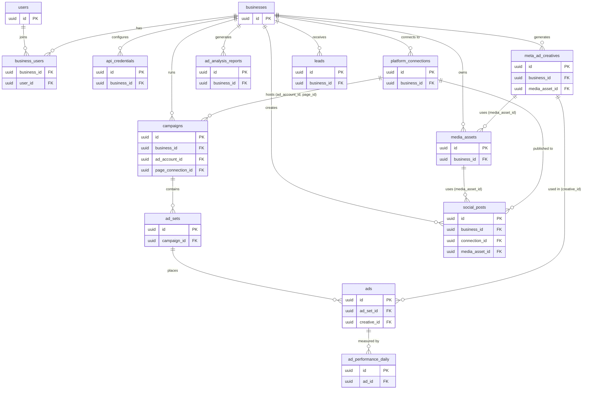
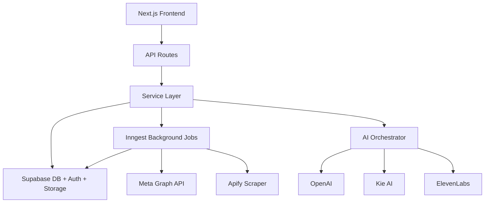
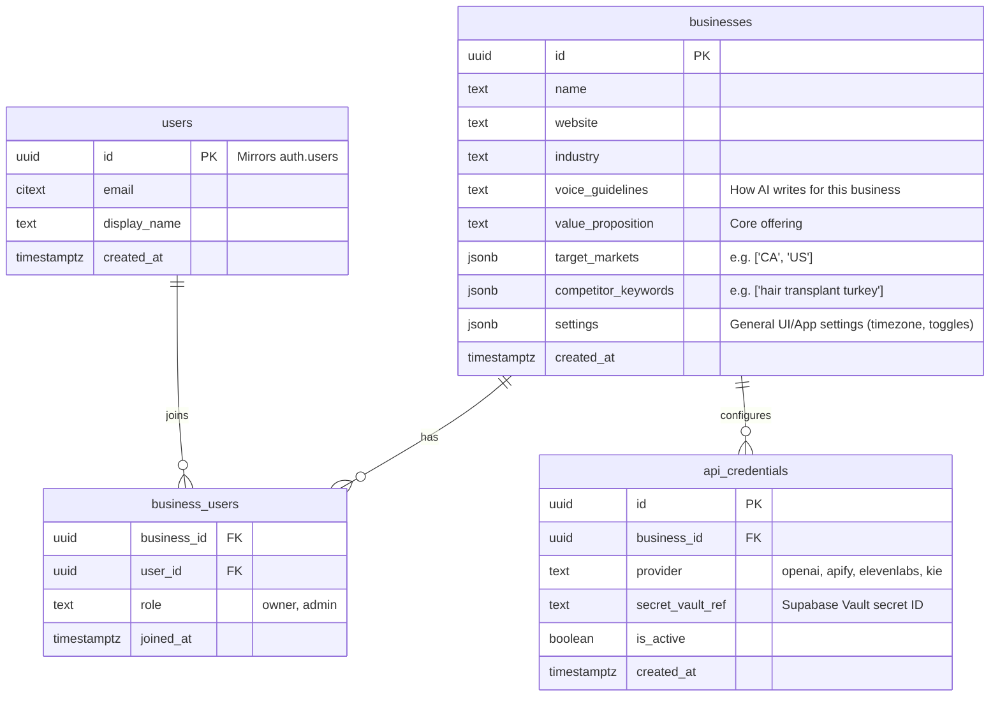
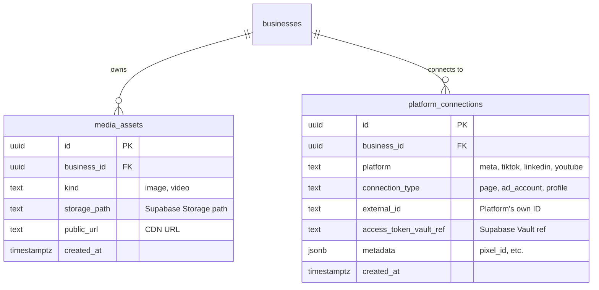
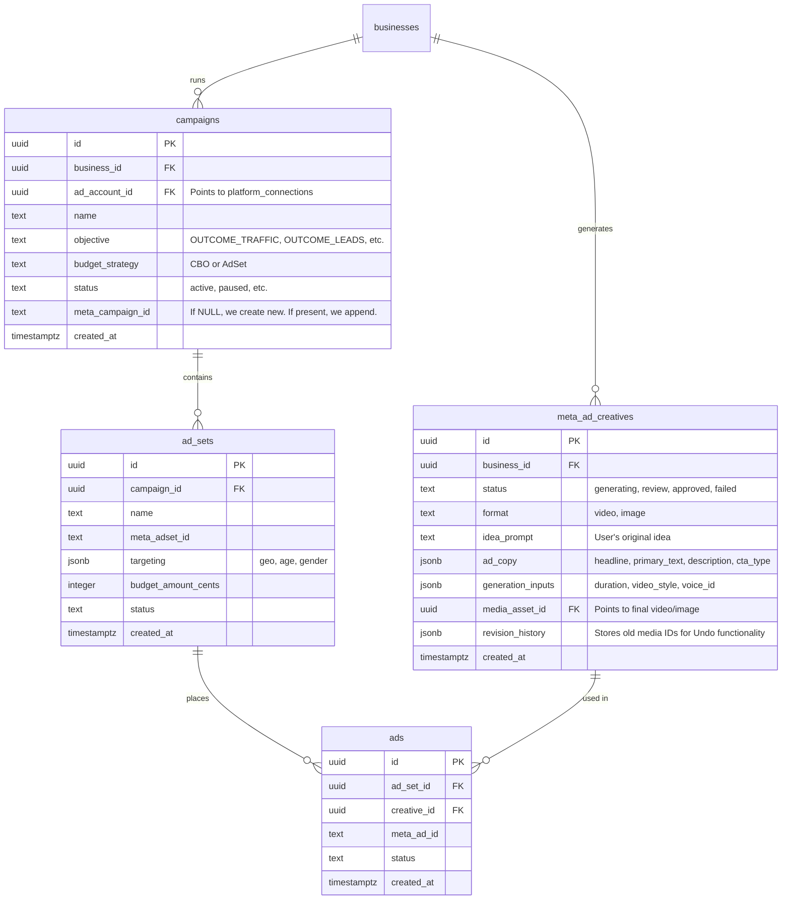
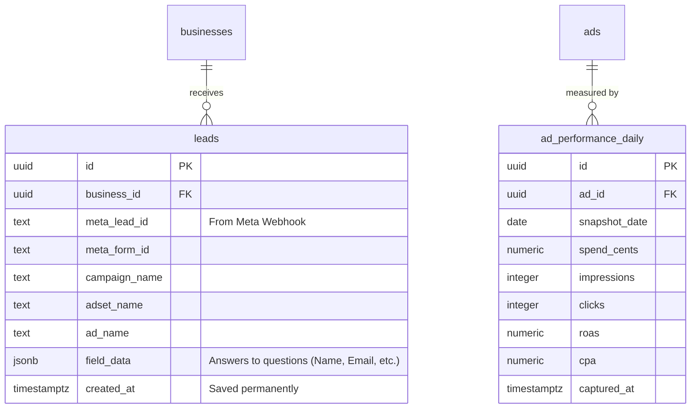
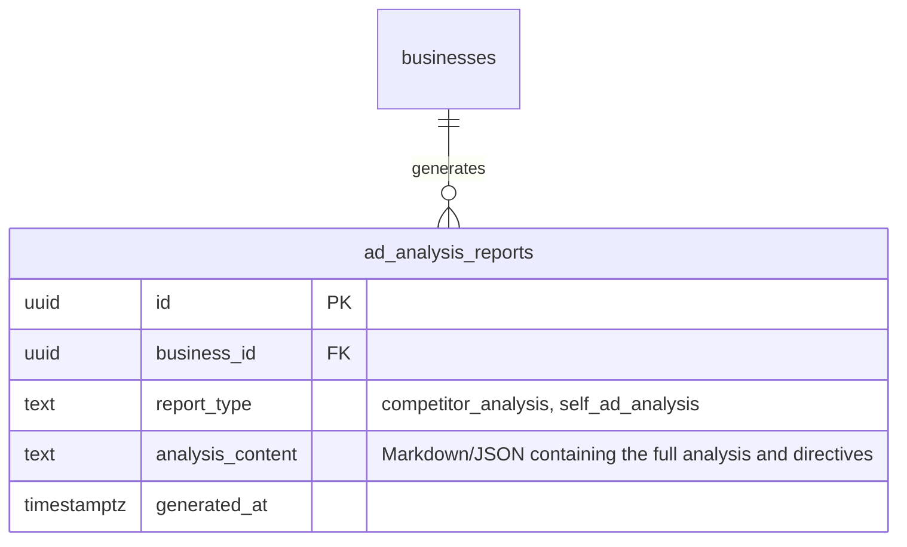
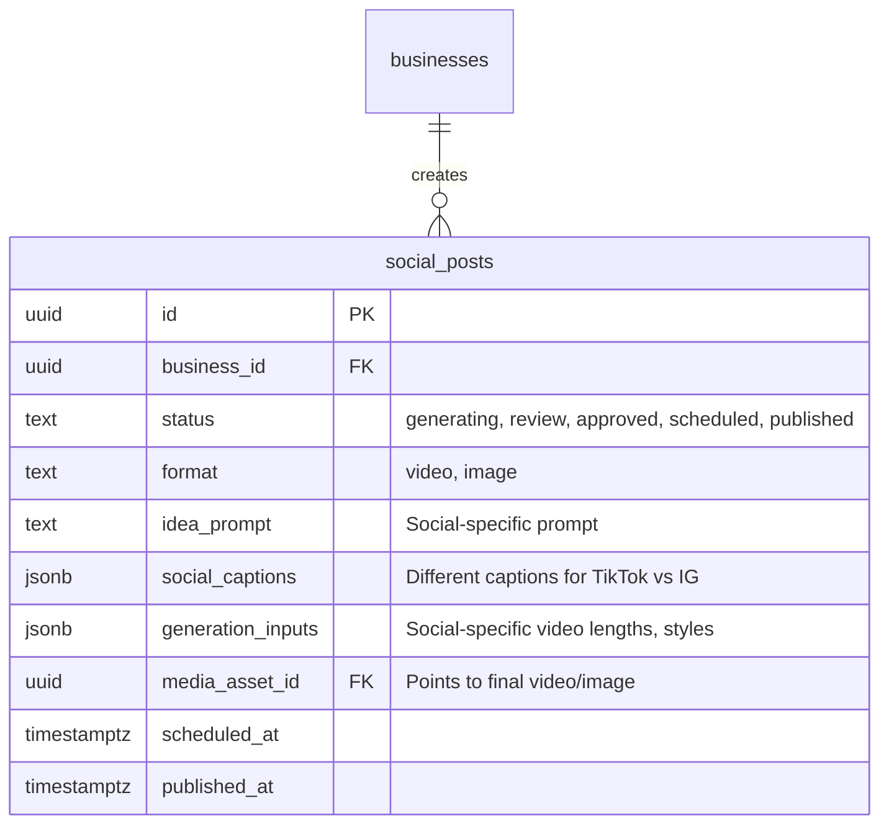

# Kinetix — Database Architecture & Data Flows

This document outlines the database architecture for Kinetix. It is a highly optimized, 14-table schema built to handle Meta Ads, Social Media publishing, and AI-driven ad intelligence at scale.

## Complete Database Schema Overview

The following diagram provides a bird's-eye view of all 14 tables in the system and how they connect to one another. 
> *Note: For readability, only the Primary Keys (PK) and Foreign Keys (FK) are shown in this global view. See the individual sections below for full table schemas.*



---

## High-Level System Architecture



---

## 1. Core Users & Businesses

The platform is multi-tenant at the **Business** level. Users can belong to multiple businesses. All API credentials (OpenAI, Apify, etc.) are stored at the business level.



---

## 2. Media Library & Platform Connections

A unified media library holds all generated and uploaded assets. Platform connections store OAuth tokens for Meta, TikTok, etc., securely linking to Supabase Vault.



---

## 3. Meta Ads Module

This schema strictly mirrors Meta's API structure (Campaigns → Ad Sets → Ads). 
**Note:** `meta_ad_creatives` is separate from `ads`. A creative is what the AI generates (the media + copy). An `ad` is the object on Meta that combines the creative with targeting.



---

## 4. Leads & Performance Metrics (For AI Storage)

We store leads permanently because Meta deletes them after 90 days. We store a daily snapshot of metrics strictly for the AI to analyze historical trends without hitting Meta API rate limits. (The frontend dashboard will still fetch live data directly from Meta).



---

## 5. Ad Analysis Engine

No raw competitor ads are stored. The scraper feeds JSON directly into the AI, and we only save the final, massive analytical report.



---

## 6. Social Media Module

Has its own table for inputs, but behind the scenes, Inngest runs the exact same video/image generation pipeline as Meta Ads.



---

## 7. Background Jobs (Inngest) Overview

1. `scrape-and-analyze-competitors` (Weekly: Apify -> AI -> saves to `ad_analysis_reports`)
2. `poll-daily-metrics` (Daily: Meta Insights -> saves to `ad_performance_daily` for AI use)
3. `analyze-self-performance` (Weekly: Reads `ad_performance_daily` -> AI -> saves to `ad_analysis_reports`)
4. `generate-meta-creative` (Event: runs video/image pipeline -> updates `meta_ad_creatives`)
5. `generate-social-post` (Event: reuses same pipeline code -> updates `social_posts`)
6. `deploy-meta-campaign` (Event: pushes structure to Meta API)
7. `meta-lead-webhook` (Event: receives real-time lead -> saves to `leads`)

---

## 8. Core Feature Data Flows

### A. Ad Generation & Refinement Flow

#### Step 1: User requests a new Ad
We insert a new row into `meta_ad_creatives` with status `generating`. An Inngest job is triggered.
```json
{
  "id": "c1a...",
  "business_id": "b1...",
  "status": "generating",
  "format": "video",
  "idea_prompt": "Create an ad for our Summer Sale on hair transplants.",
  "ad_copy": null,
  "media_asset_id": null,
  "revision_history": []
}
```

#### Step 2: AI Finishes Generation
We save the video to `media_assets`. We update `meta_ad_creatives` with the copy and link the video. Status changes to `review`.
```json
{
  "status": "review",
  "ad_copy": {
    "headline": "Summer Sale: 50% Off",
    "primary_text": "Get your confidence back this summer..."
  },
  "media_asset_id": "media-v1" 
}
```

#### Step 3: User Refines the Ad Media (Quick Edit)
The user selects **"Quick Edit"** and types: *"Change his shirt to blue"*.
We snapshot the old video ID into `revision_history` (for Undo). We send the *existing* video (`media-v1`) to an AI Video-to-Video model. We save the result as `media-v2` and update the row.
```json
{
  "status": "review", 
  "media_asset_id": "media-v2", 
  "revision_history": [
    {
      "action": "Quick Edit: Change his shirt to blue",
      "previous_media_id": "media-v1", 
      "previous_ad_copy": { "headline": "Summer Sale: 50% Off" },
      "timestamp": "2026-07-14T10:00:00Z"
    }
  ]
}
```

### B. Campaign Launch Flow

#### Case 1: Creating a Brand New Campaign
We call the Meta API, create everything, and save the structure to our DB. `meta_campaign_id` is populated.
```json
// campaigns table
{
  "name": "Summer Blowout 2026",
  "objective": "OUTCOME_TRAFFIC",
  "budget_strategy": "CBO",
  "budget_amount_cents": 5000, 
  "meta_campaign_id": "1234567890" 
}

// ad_sets table
{
  "name": "Broad Audience - Men",
  "targeting": { "gender": [1], "age_min": 25, "age_max": 45 },
  "meta_adset_id": "9876543210" 
}

// ads table
{
  "creative_id": "c1a...", 
  "meta_ad_id": "1122334455" 
}
```

#### Case 2: Appending to an Existing Meta Campaign
We only create a new Ad Set and Ad on Meta. In our DB, we save the `campaigns` row but we set `meta_campaign_id` to that existing ID. 
```json
// campaigns table
{
  "name": "Always On - Retargeting", 
  "meta_campaign_id": "555555555" // ID of the pre-existing campaign
}
```

### C. Social Media Flow

The user posts a video to TikTok and Instagram. We insert into `social_posts`. The Inngest job runs the exact same AI video generation pipeline as Meta Ads, but tailors captions for social.
```json
{
  "status": "scheduled",
  "format": "video",
  "social_captions": {
    "tiktok": "Wait until the end... 😱 #clinic #bts",
    "instagram": "A day in the life at our clinic! Book a consult today. ✨"
  },
  "media_asset_id": "m9z...", 
  "scheduled_at": "2026-07-20T10:00:00Z"
}
```

### D. Ad Analysis Flow (Competitor + Self)

#### The Competitor Analysis (Weekly)
Apify runs and returns a massive JSON array of 200 ads. We DO NOT save the 200 ads to the DB. We send that massive JSON directly to the AI, and save only the final, intelligent output.
```json
{
  "report_type": "competitor_analysis",
  "analysis_content": {
    "executive_summary": "Competitors are heavily using user-generated content (UGC)...",
    "top_hooks": ["Are you tired of hair loss?", "I tried 3 clinics..."],
    "action_plan": "Shift away from cinematic videos; test selfie-style UGC."
  }
}
```

#### The Self Analysis (Weekly)
The AI job reads the `ad_performance_daily` table for the last 7 days, looks for trends, and generates a report focused on your ads.
```json
{
  "report_type": "self_ad_analysis",
  "analysis_content": {
    "performance_summary": "Overall ROAS is up 5%.",
    "winning_ads": ["Summer Sale - Video 2"],
    "recommendations": "Pause the Image 1 ad. Scale budget on Video 2."
  }
}
```
