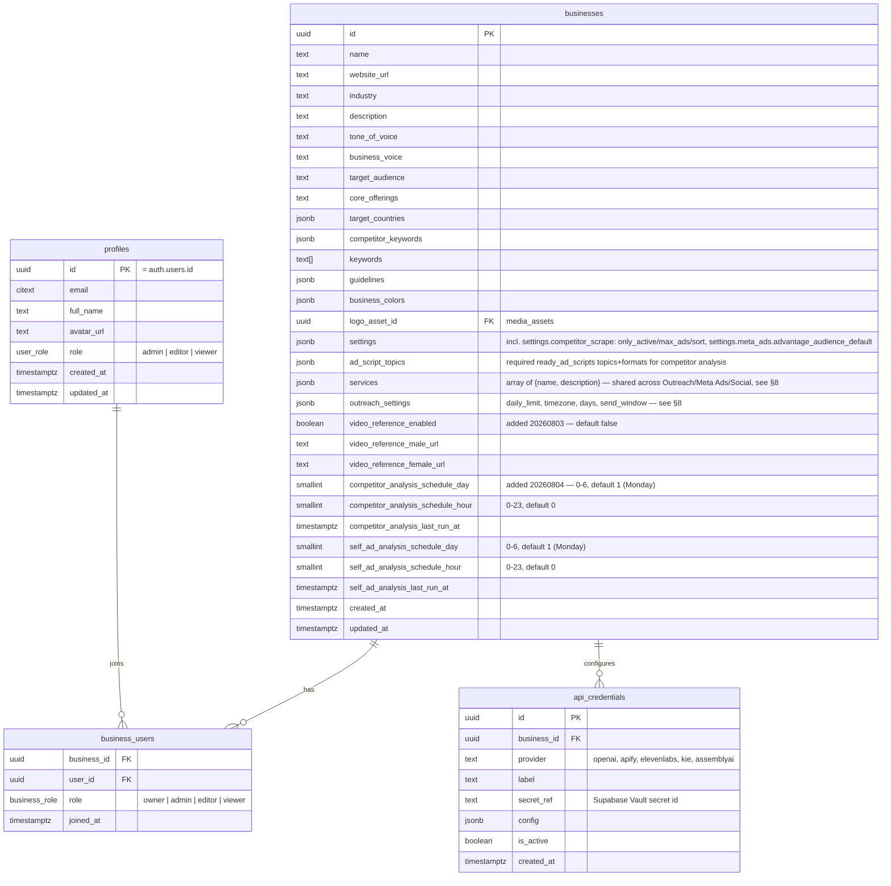
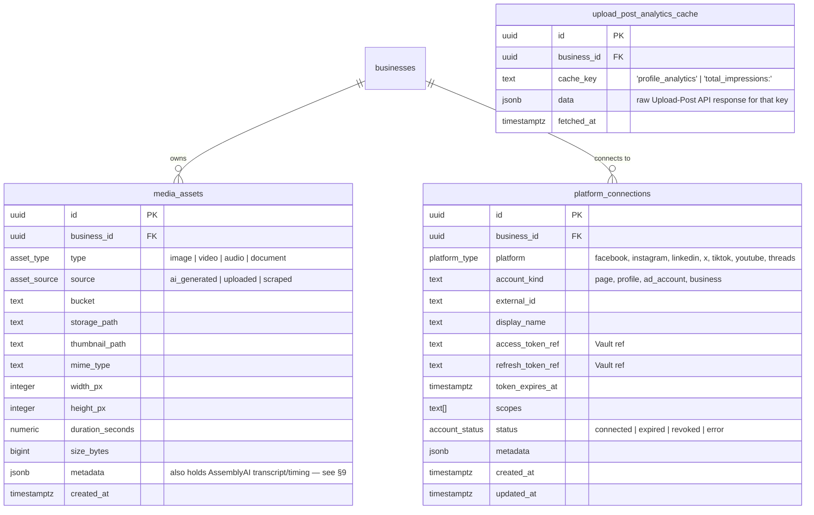
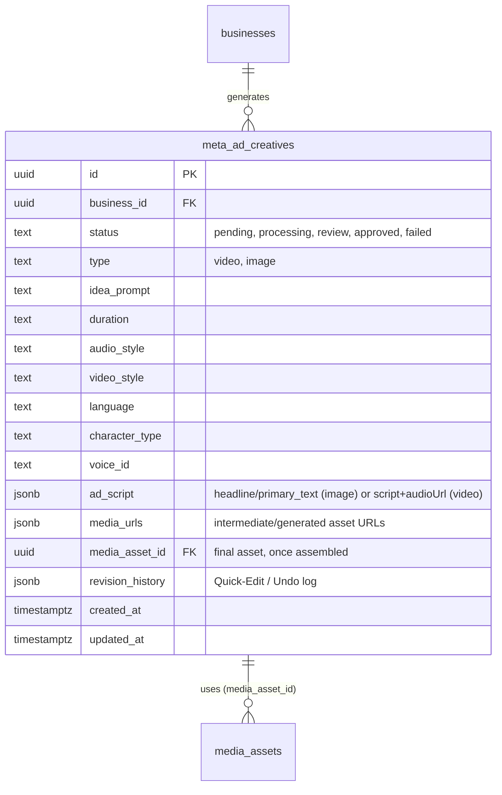
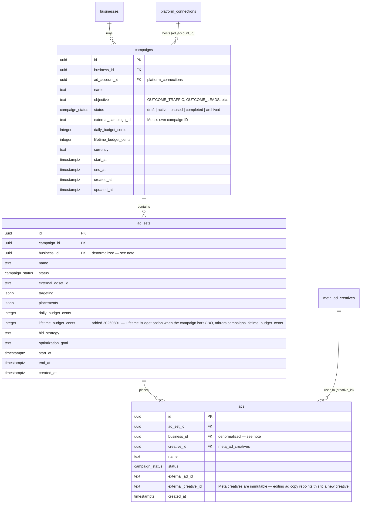
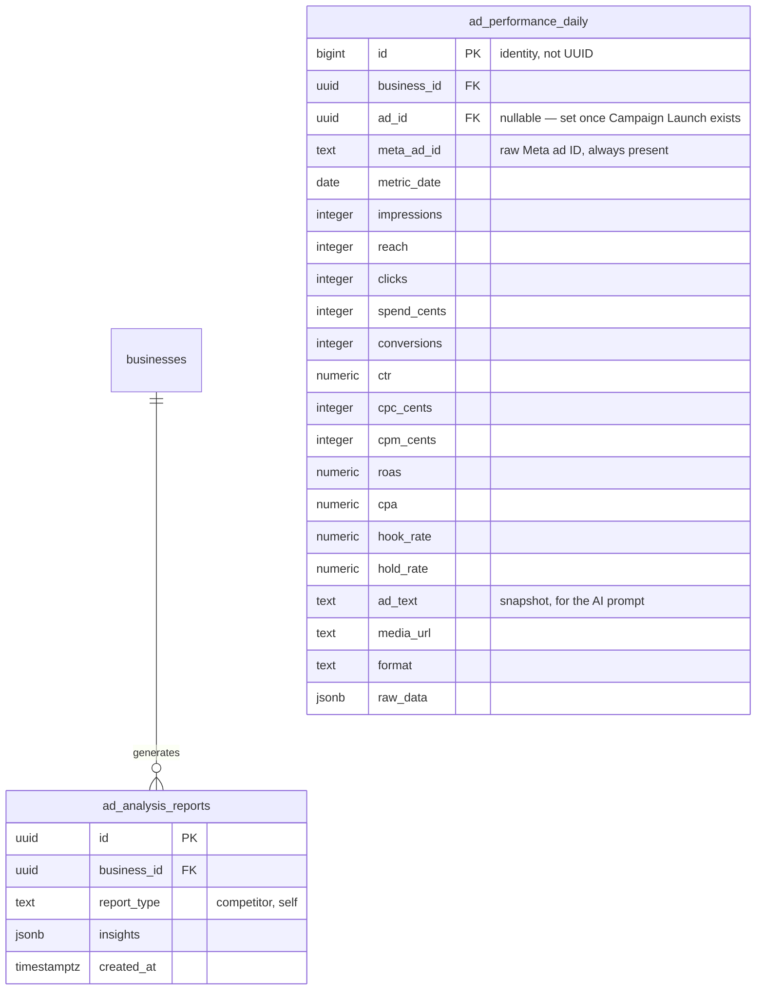
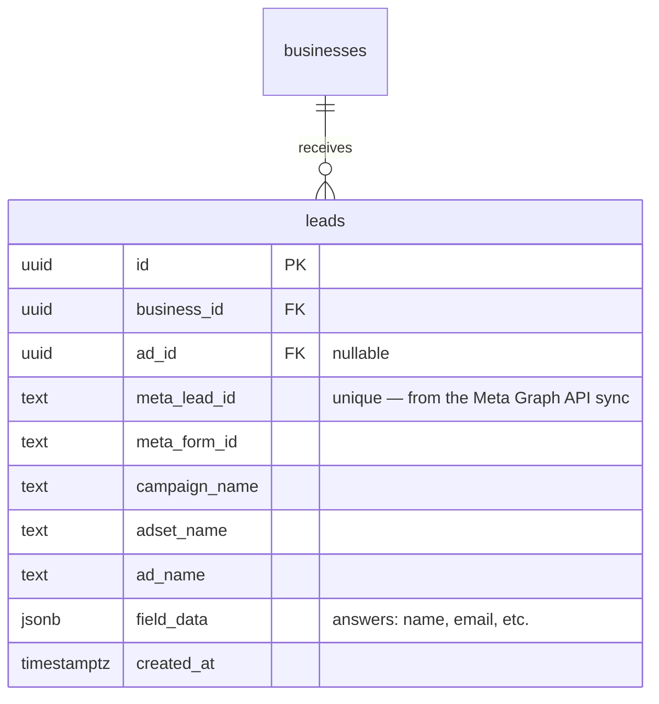
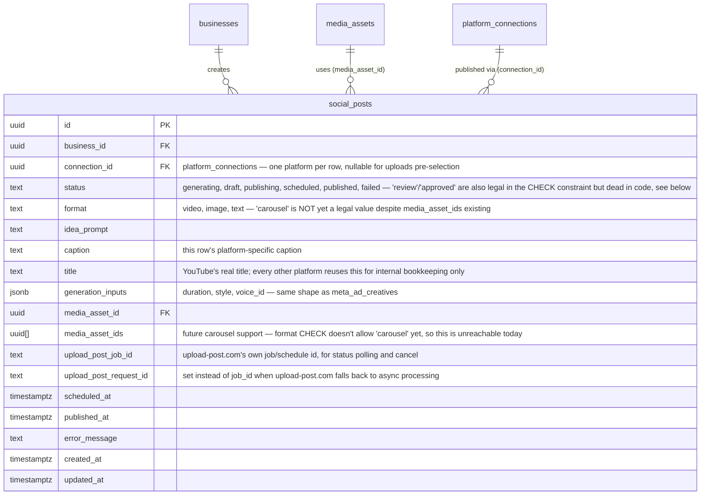
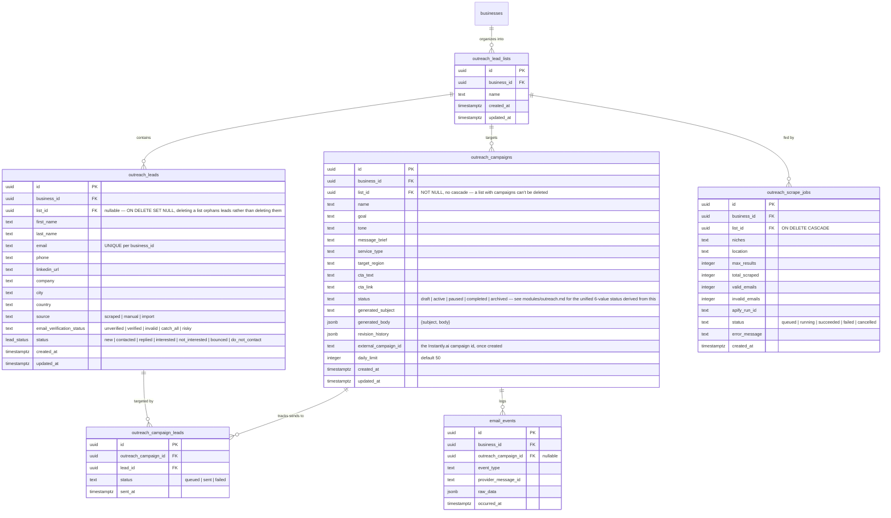

# Kinetix — Database Architecture & Data Flows

This describes the schema exactly as it exists live today — migrated and verified column-by-column against `supabase/migrations/`. It is not an idealized target; every column below is what's actually in the database right now. Two groups of tables exist: the original **14-table core** (§1–§7, Meta Ads + Social Media + shared infrastructure) and the **Outreach schema** (§8, added later, independently evolving) — there's no single fixed table count worth quoting as a headline number, since the schema keeps growing as modules get built.

**Multi-tenant-shaped, single-tenant in practice:** the tenant entity is `businesses`, with a `business_users` membership table, but the deployment runs with exactly **one** `businesses` row. See `system_design.md` §3 for the auto-enroll trigger that makes this cost nothing operationally.

## 0. Reading this document

A few things are worth knowing up front, because they're the result of deliberate decisions made while reconciling this schema against a real, already-working codebase — not oversights:

- **`meta_ad_creatives` uses flat generation-config columns (`duration`, `audio_style`, `video_style`, `language`, `character_type`, `voice_id`) and a Json `ad_script`/`media_urls`, not a consolidated `ad_copy`/`generation_inputs` shape.** An earlier draft of this doc proposed the consolidated version; it was deliberately not adopted because the working image/video generation Inngest jobs already read and write the flat shape, and consolidating it would mean rewriting a pipeline that already works, for no functional gain.
- **`social_posts` is one row per platform, not one row per post.** Posting the same creative to Instagram and TikTok is two rows sharing `media_asset_id`, each with its own `connection_id`, `caption`, and `status` — this is what lets "Instagram published, TikTok failed" be tracked as two independent outcomes instead of being unrepresentable.
- **`ad_analysis_reports.report_type` values are `'competitor'` and `'self'`** (not `'competitor_analysis'`/`'self_ad_analysis'`) — that's what the real jobs filter on.
- **Several tables carry column names from the original 2024 migration that predate this reconciliation** (`external_campaign_id` not `meta_campaign_id`, `account_kind` not `connection_type`, `access_token_ref`/`secret_ref` not `*_vault_ref`, `type` not `kind`). These were left as-is rather than renamed, since nothing was broken and renaming would be pure churn.
- **No RAG, no vector DB, no Pinecone.** Competitor/self-ad intelligence and outreach email drafting all come from direct context-window prompting — see `system_design.md` §4.
- **`meta_ad_creatives`, `ad_analysis_reports`, `ad_performance_daily`, and the competitor/self-ad analysis jobs are real, working code.** So is the entire Outreach schema in §8. Campaign Launch (paid Meta campaigns) and Meta Lead Capture are also real, working code — see `modules/meta_ads.md`.

## 1. Core: Users & Businesses



`business_voice` and `tone_of_voice` are separate, both real — the former was added later specifically for AI-generation prompts (see `services/prompts/*.prompt.ts`), the latter predates it from the original design. Both exist; nothing consolidates them today.

See `system_design.md` §3 for the trigger that auto-enrolls every new profile into the single `businesses` row via `business_users`.

## 2. Media Library & Platform Connections



There's no stored `public_url` column on `media_assets` — public URLs are derived at request time via Supabase Storage's `getPublicUrl(bucket, storage_path)`, not persisted.

**`platform_connections` in practice today only has one real writer: Social Media, and only with `account_kind = "upload_post"`.** Accounts aren't connected via OAuth from Kinetix — they're connected by hand on upload-post.com's own dashboard; Kinetix's `/api/social/upload-post/sync` route mirrors that connection state into this table (plus the Facebook/LinkedIn Page IDs needed at publish time) purely for local display and lookup. The `access_token_ref`/`refresh_token_ref`/`scopes` columns shown above are part of the general-purpose shape but are unused by this writer — see `modules/social_media.md` §1 for the full mechanism. Meta Ads does not use this table at all as of today (it reads Meta credentials via `src/config/env.ts`'s zod schema — see `CLAUDE.md`'s Meta Ads section).

**`upload_post_analytics_cache`** (added `20260806000000_upload_post_analytics_cache.sql`) exists purely so the Root and Social dashboards never call Upload-Post's own analytics API live — that API aggregates each connected platform server-side and can take several seconds, which a dashboard page load can't afford. `jobs/social-analytics-cache-refresh.job.ts` (cron, every 5 minutes) is the only writer; both dashboard routes only ever read it — see `system_design.md`'s "Never call a slow third-party API from a page-load GET route" note. One row per `(business_id, cache_key)`, upserted in place — this isn't an audit log, just a single current snapshot per key.

## 3. Ad Creative Generation (Meta Ads) — the first module with real, working code



`revision_history` is an append-only array — prior `media_asset_id`, prior `ad_script`, a human-readable action string, and a timestamp — powering Quick Edit / Undo.

There is no CHECK constraint on `meta_ad_creatives.service` anymore. An earlier constraint (`chk_meta_ad_creatives_service`) hardcoded 3 service names from before `businesses.services` was configurable in Settings — it silently rejected creative-generation inserts for any service beyond those 3, and was dropped in `20260805000000_drop_stale_service_check.sql`. The Create Ad modal (driven by `businesses.services`) is now the sole source of truth for which services are selectable.

## 4. Meta Ads (paid campaign structure) — built



`ad_sets` and `ads` carry `business_id` directly even though it's implied by their parent chain — this keeps RLS on those tables a flat check instead of a nested join, and lets both be indexed by `business_id` directly.

`ad_sets.placements` shape: `{ mode: "advantage_plus" }` (Meta picks automatically — the default) or `{ mode: "manual", publisher_platforms, facebook_positions?, instagram_positions? }`. Sent to Meta for real when "manual" is chosen — unlike the legacy project's equivalent UI, which collected manual placement choices but never actually forwarded them to Meta.

## 5. Intelligence Engine — Competitor + Self Analysis

Only one table here is business-facing: `ad_analysis_reports`. There is deliberately no supporting gallery table for individual competitor ads.



`ad_performance_daily` inherited its `bigint` identity PK from the original 2024 migration (`ad_metrics_daily`) — it was never a UUID, and there's no reason to change it. `ad_id`/`ctr`/`cpc_cents`/`cpm_cents`/`raw_data`/`reach` are original columns; `meta_ad_id`, `roas`, `cpa`, `hook_rate`, `hold_rate`, `ad_text`, `media_url`, `format` were added when this table absorbed what used to be a separate `meta_self_ad_metrics` table (see §10 for that history).

**Competitor analysis — removed.** The weekly Apify-scrape-and-analyze job (`competitor-ad-scraper.job.ts`) and its Dashboard display were both removed from the app. `ad_analysis_reports` still allows `report_type = 'competitor'` and any rows written before removal may still exist (still read by the Ad Creative Generation pipeline for market context, see below), but nothing generates new ones anymore.

**Performance sync — daily** (`meta-ads-performance-sync.job.ts`, cron `0 4 * * *`): fetches each business's own ads, campaigns, and insights directly from the Meta Graph API, and upserts one `ad_performance_daily` row per ad per day.

**Self-ad analysis — weekly, conditional** (`business-ad-analysis.job.ts`): aggregates `ad_performance_daily` per ad (skipping businesses with 10 or fewer distinct ads), scores "seasoned" (7+ day) ads on a CTR-curve formula, and writes a report to `ad_analysis_reports` (`report_type = 'self'`).

Both the self report and any pre-existing competitor report are read back in every time the Ad Creative Generation pipeline runs (business context + latest `competitor`/`self` reports feed the AI script-generation prompt).

## 6. Leads — built (Meta Ads Instant Forms)



Kept permanently — Meta purges leads after 90 days. No webhook: `GET /api/meta-ads/leads` syncs straight from the Graph API whenever the Leads page's first page is requested (see `modules/meta_ads.md`), upserting on `meta_lead_id` — this is what makes it safe to sync repeatedly (page-open, "Sync now", or both back to back) without ever creating duplicates. Not to be confused with `outreach_leads` (§8) — this table is exclusively for inbound Meta Instant Forms leads; outreach leads are sourced by Apify scraping or manual entry.

## 7. Social Media — built, real



One row = one platform: posting the same generated video to Instagram and TikTok creates **two** `social_posts` rows, sharing `media_asset_id` and `idea_prompt`, each with its own `connection_id`, `caption`, and `status` — see `modules/social_media.md`.

## 8. Outreach — built, real (added after the original 14-table core)

Outreach's schema was built out fully and has kept evolving (7 migrations from `20260725000000_newsletter_outreach_schema.sql` through `20260731000000_outreach_send_window_24h.sql` — the first migration's filename predates a later module that was since removed entirely). See `modules/outreach.md` for the module's full architecture — this section is the schema reference only.



Notes on this schema, most relevant for anyone about to alter it:
- **`outreach_campaign_leads` is deliberately per-campaign, not a global "already contacted" flag.** A lead can be queued again by a *different* campaign — its own `status` (on `outreach_leads`) is the general-purpose signal, while `outreach_campaign_leads.status` tracks this specific campaign's send outcome.
- **`outreach_campaigns.list_id` has no cascade** (a list with campaigns pointing at it can't be deleted), while **`outreach_scrape_jobs.list_id` cascades** (deleting a list deletes its scrape-job history) — an intentional asymmetry, not an oversight.
- **`email_events`** predates a later schema split — it was originally a shared table with a `channel` check constraint (`'newsletter' | 'outreach'`) and a `contact_id` column. The other module that once shared this table was removed entirely (see below), so in practice this table is outreach-only today, though the `channel` constraint may still literally allow the now-unused `'newsletter'` value — verify against `src/types/supabase.ts` before relying on an exact constraint shape here, and consider a follow-up migration to tighten the constraint to `'outreach'`-only.
- **`businesses.services`** (`jsonb`, array of `{name, description}`) and **`businesses.outreach_settings`** (`jsonb` — `daily_limit`, `timezone`, `days`, `send_window: {from, to}`) were added specifically for Outreach but are shared/available to every module. `outreach_settings` currently defaults to a full-day send window (`00:00`–`23:59`) — an earlier default of business-hours-only (`09:00`–`18:00`) made a freshly-created campaign look "broken" (no visible send activity outside those hours) with no settings UI yet to explain or change it.
- **Tables that existed briefly and were dropped**: `contact_categories` and `contacts` (replaced by `outreach_lead_lists`/`outreach_leads`), `outreach_campaign_contacts` (replaced by `outreach_campaign_leads`), plus a full set of tables belonging to a module that has since been removed from the product entirely (see the migration history below).

## 9. Row Level Security

```sql
CREATE OR REPLACE FUNCTION public.user_business_ids()
RETURNS SETOF UUID LANGUAGE sql STABLE SECURITY DEFINER SET search_path = public AS $$
    SELECT business_id FROM business_users WHERE user_id = auth.uid();
$$;

CREATE OR REPLACE FUNCTION public.user_business_write_ids()
RETURNS SETOF UUID LANGUAGE sql STABLE SECURITY DEFINER SET search_path = public AS $$
    SELECT business_id FROM business_users
    WHERE user_id = auth.uid() AND role IN ('owner', 'admin', 'editor');
$$;

-- Applied to every business_id-scoped table:
CREATE POLICY meta_ad_creatives_read ON meta_ad_creatives
    FOR SELECT TO authenticated
    USING (business_id IN (SELECT public.user_business_ids()));

CREATE POLICY meta_ad_creatives_write ON meta_ad_creatives
    FOR ALL TO authenticated
    USING (business_id IN (SELECT public.user_business_write_ids()))
    WITH CHECK (business_id IN (SELECT public.user_business_write_ids()));
```

With one `businesses` row and every user auto-enrolled into it (`system_design.md` §3), these policies are trivially true for every authenticated user today. The moment a second business exists, isolation is already enforced without touching a single policy.

Inngest jobs write with the service-role key, which bypasses RLS entirely — expected, since it's the only way a background worker can write at all. Every job payload carries `businessId` explicitly; there's no session inside a worker to derive it from.

## 10. Media & Captions

`media_assets.metadata` also holds the AssemblyAI transcript and word-level timing for any video with dynamic subtitles (used to burn in synced captions during final video assembly) — no dedicated column for this.

## 11. History — how this schema got here

1. **`brands` → `businesses`.** Renamed the tenant table, added `business_users` + the auto-enroll trigger, renamed `connected_accounts`→`platform_connections`, `provider_credentials`→`api_credentials`, `ad_campaigns`/`ad_metrics_daily`→`campaigns`/`ad_performance_daily`, `meta_ad_intelligence`→`ad_analysis_reports`. Added `leads` and `social_posts` (new). Retired `posts`/`post_assets`/`post_metric_snapshots` in favor of `social_posts`, and a batch of already-dead tables.
2. **Forced down to exactly 14 tables (temporary — see below).** Dropped `newsletters`/`subscribers`/`newsletter_sends`/`newsletter_recipients`, all 6 `outreach_*` tables that existed at the time, `generation_jobs`, and `audit_logs`. Folded `meta_self_ad_metrics`'s columns into `ad_performance_daily`. Retired `meta_competitor_ads` entirely — the competitor scraper now dedupes/scores in memory within a single run instead of persisting a gallery.
3. **Terminology + cleanup.** Renamed `businesses.brand_voice`→`business_voice`, `brand_colors`→`business_colors`, cleaned up stale constraint names, dropped an orphaned column.
4. **Newsletter + Outreach schema added together** (`20260725000000_newsletter_outreach_schema.sql`) — shared `contacts`/`contact_categories`/`email_events` plus module-specific tables for both.
5. **Outreach campaign fields** (`20260726000000_outreach_campaign_fields.sql`) — added `service_type`/`target_region`/`cta_text`/`cta_link` to `outreach_campaigns`, made `category_id` (the predecessor to `list_id`) required.
6. **Outreach's own lead schema** (`20260727000000_leads_schema.sql`) — replaced the shared `contacts`/`contact_categories`/`outreach_campaign_contacts` with dedicated `outreach_leads`/`outreach_lead_lists`/`outreach_campaign_leads`, renamed the `contact_status` enum to `lead_status`.
7. **Newsletter schema dropped** (`20260728000000_drop_newsletter_schema.sql`) — that module wasn't being pursued; its tables and `newsletter_campaign_id`/enum remnants were removed rather than left half-built.
8. **`businesses.services`** (`20260729000000_business_services.sql`) — added as a plain array, then converted to the current `jsonb` `{name, description}[]` shape one migration later.
9. **`businesses.outreach_settings`** (`20260730000000_business_outreach_settings.sql`) — daily limit / timezone / send days / send window, JSON. Now editable via Settings → Automation Defaults (see #11 below); had no settings UI for one migration.
10. **Send window widened** (`20260731000000_outreach_send_window_24h.sql`) — default send window changed from business-hours-only to all-day, since a campaign sent outside the narrower window looked broken with no UI to explain why.
11. **`ad_sets.lifetime_budget_cents`** (`20260801000000_ad_sets_lifetime_budget.sql`) — lets an ad set use a Lifetime Budget (not just Daily) when its parent campaign isn't using Campaign Budget Optimization, mirroring the existing `campaigns.lifetime_budget_cents`.
12. **`businesses.video_reference_*`** (`20260803000000_business_video_reference.sql`) — adds `video_reference_enabled`/`video_reference_male_url`/`video_reference_female_url`. Replaced two hardcoded Cloudinary URLs in `src/services/ai/character-references.ts` with business-configurable uploads, and fixed a real bug where the male/female reference photos were being picked per product-area instead of per-gender (a female Meta Ads video always got the male photo, and vice versa for Social).
13. **`businesses.*_analysis_schedule_*`** (`20260804000000_business_analysis_schedules.sql`) — adds `competitor_analysis_schedule_day/hour/last_run_at` and `self_ad_analysis_schedule_day/hour/last_run_at` (day 0-6, hour 0-23, CHECK-constrained, both default Monday/0). Replaced the two analysis jobs' hardcoded weekly cron expressions with a per-business day/hour, checked hourly — see `system_design.md` §2.D.
14. **Dropped `chk_meta_ad_creatives_service`** (`20260805000000_drop_stale_service_check.sql`) — this CHECK constraint hardcoded 3 service names from an earlier single-service setup and was silently rejecting ad-creative-generation inserts for any newer/renamed service, now that `businesses.services` is business-configurable via Settings.
15. **`upload_post_analytics_cache`** (`20260806000000_upload_post_analytics_cache.sql`) — added so the Root/Social dashboards could stop calling Upload-Post's analytics API live (a measured ~several-second round trip), kept warm by a 5-minute Inngest job. **That job was later removed** — both dashboard routes now call Upload-Post live again on every request, by deliberate choice (see `system_design.md` §2's note on Leads/dashboards calling their APIs live). The table itself is still here, just unused.

## 12. Worked Examples

### A. Ad Generation & Refinement

```json
// meta_ad_creatives — insert
{ "business_id": "b1…", "status": "pending", "type": "video", "idea_prompt": "Summer sale on hair transplants" }

// meta_ad_creatives — after generation
{ "status": "review", "ad_script": { "script": ["..."], "audioUrl": "https://..." }, "media_urls": ["https://kie.ai/..."] }
```

### B. Competitor Analysis (weekly, automatic — nothing persisted before this)

```json
{
  "business_id": "b1…", "report_type": "competitor",
  "insights": {
    "executive_summary": "Competitors are heavily using user-generated content (UGC)...",
    "market_insights": { "dominant_ad_format": "video", "dominant_emotional_angle": "trust/proof" }
  }
}
```

### C. Social Post (one row per platform)

```json
// social_posts — Instagram
{ "business_id": "b1…", "connection_id": "ig-conn…", "idea_prompt": "Day in the life at our clinic",
  "media_asset_id": "m9z…", "caption": "A day in the life at our clinic! Book a consult today. ✨",
  "status": "scheduled", "scheduled_at": "2026-07-20T10:00:00Z" }

// social_posts — TikTok (same shoot, independent row and status)
{ "business_id": "b1…", "connection_id": "tt-conn…", "idea_prompt": "Day in the life at our clinic",
  "media_asset_id": "m9z…", "caption": "Wait until the end... 😱 #clinic #bts",
  "status": "scheduled", "scheduled_at": "2026-07-20T10:00:00Z" }
```

### D. Outreach Campaign Send

```json
// outreach_campaigns — after AI drafting, before approval
{ "business_id": "b1…", "list_id": "l1…", "name": "Q3 Dental Clinics", "status": "draft",
  "generated_subject": "Thinking about hair restoration options?",
  "generated_body": { "subject": "...", "body": "Hi {{firstName}}, ..." } }

// outreach_campaign_leads — after a send
{ "outreach_campaign_id": "c1…", "lead_id": "ld1…", "status": "sent", "sent_at": "2026-07-22T14:00:00Z" }
```
