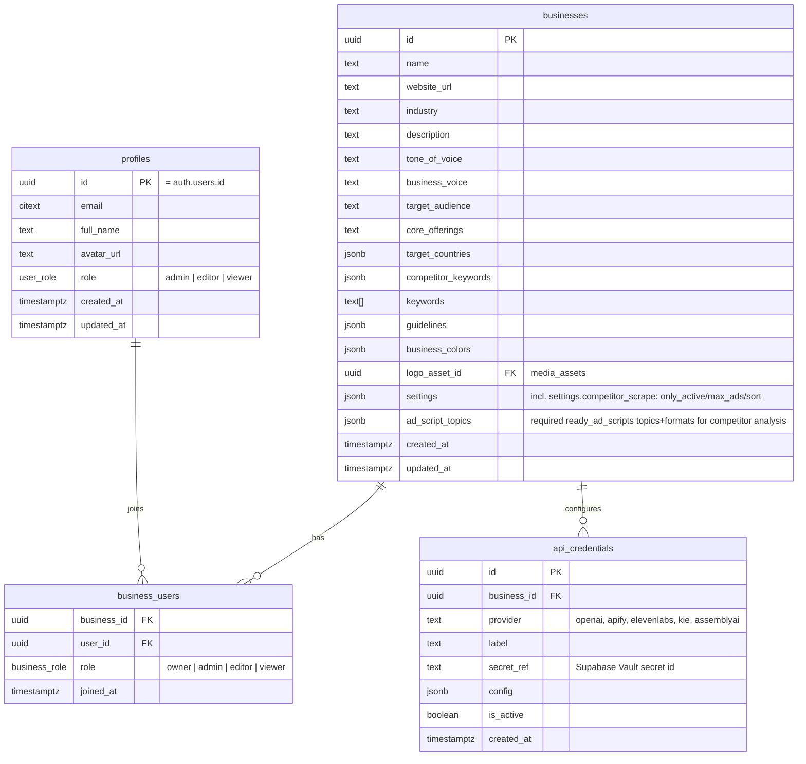
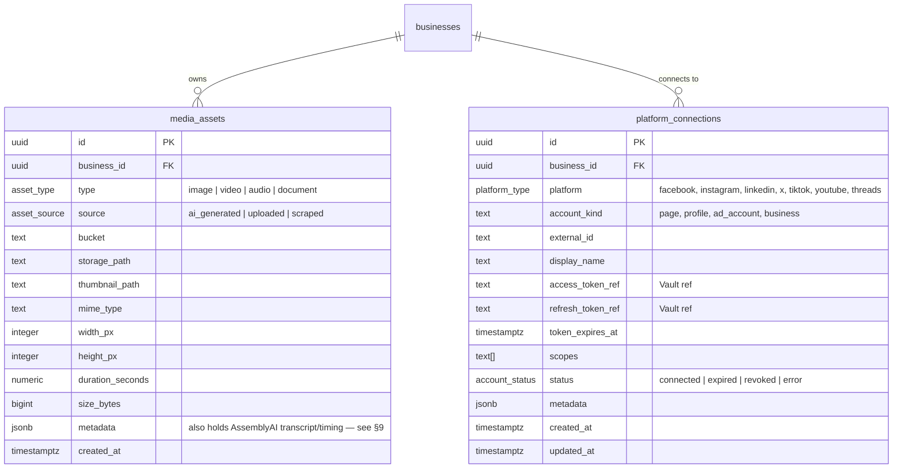
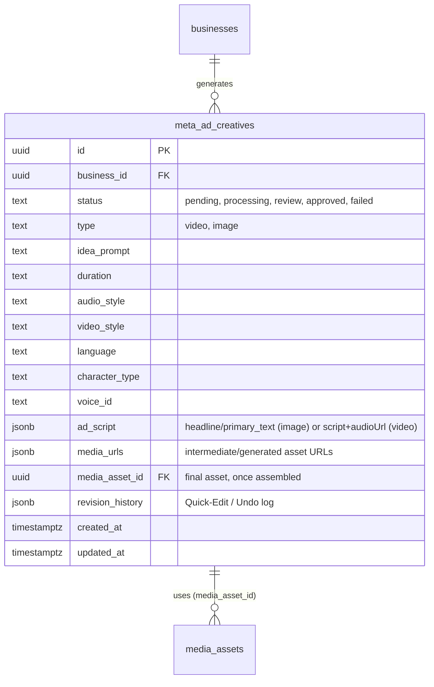
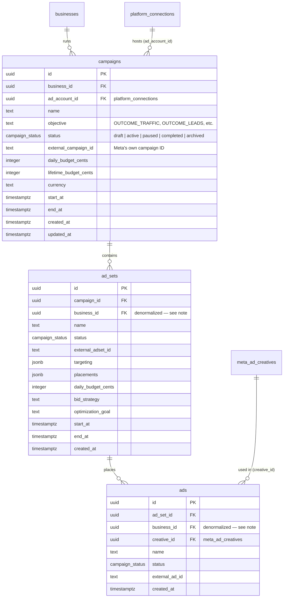
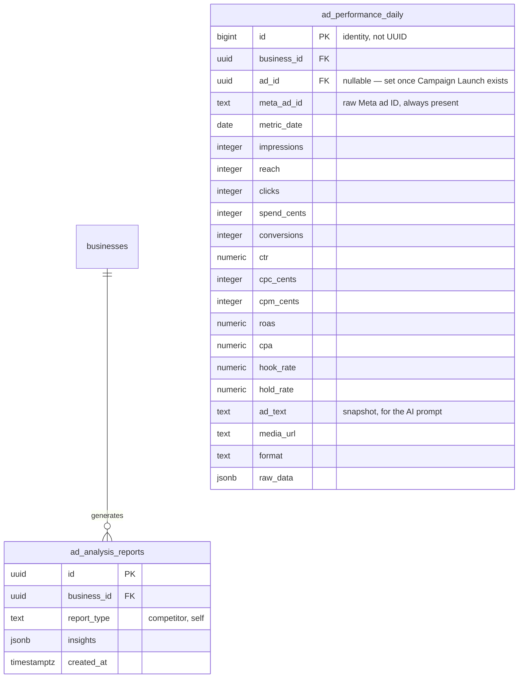
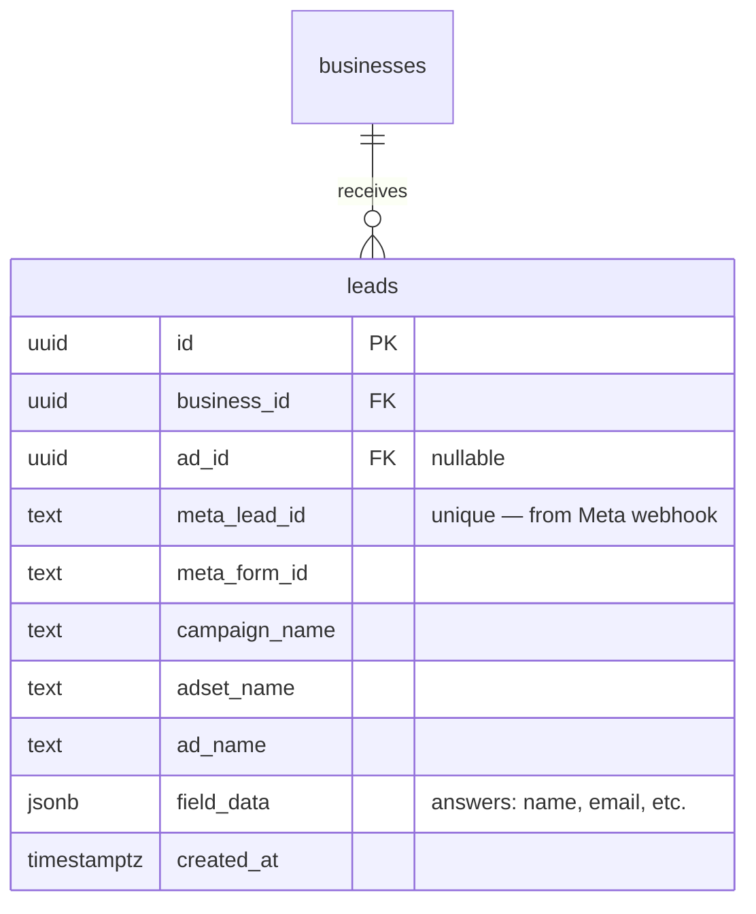
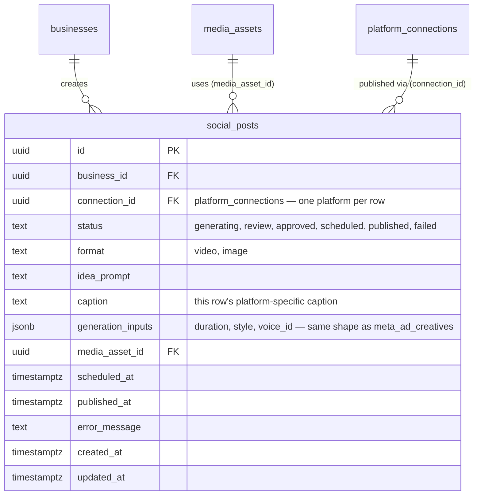

# Kinetix — Database Architecture & Data Flows

This describes the schema exactly as it exists live today — **14 tables**, migrated and verified column-by-column against `supabase/migrations/`. It is not an idealized target; every column below is what's actually in the database right now, confirmed directly against the generated Supabase types.

**Multi-tenant-shaped, single-tenant in practice:** the tenant entity is `businesses`, with a `business_users` membership table, but the deployment runs with exactly **one** `businesses` row. See `system_design.md` §3 for the auto-enroll trigger that makes this cost nothing operationally.

## 0. Reading this document

A few things are worth knowing up front, because they're the result of deliberate decisions made while reconciling this schema against a real, already-working codebase — not oversights:

- **`meta_ad_creatives` uses flat generation-config columns (`duration`, `audio_style`, `video_style`, `language`, `character_type`, `voice_id`) and a Json `ad_script`/`media_urls`, not a consolidated `ad_copy`/`generation_inputs` shape.** An earlier draft of this doc proposed the consolidated version; it was deliberately not adopted because the working image/video generation Inngest jobs already read and write the flat shape, and consolidating it would mean rewriting a pipeline that already works, for no functional gain.
- **`social_posts` is one row per platform, not one row per post.** Posting the same creative to Instagram and TikTok is two rows sharing `media_asset_id`, each with its own `connection_id`, `caption`, and `status` — this is what lets "Instagram published, TikTok failed" be tracked as two independent outcomes instead of being unrepresentable.
- **`ad_analysis_reports.report_type` values are `'competitor'` and `'self'`** (not `'competitor_analysis'`/`'self_ad_analysis'`) — that's what the real jobs filter on.
- **Several tables carry column names from the original 2024 migration that predate this reconciliation** (`external_campaign_id` not `meta_campaign_id`, `account_kind` not `connection_type`, `access_token_ref`/`secret_ref` not `*_vault_ref`, `type` not `kind`). These were left as-is rather than renamed, since nothing was broken and renaming would be pure churn.
- **No RAG, no vector DB, no Pinecone.** Competitor and self-ad intelligence come from direct context-window prompting — see `system_design.md` §4.
- **`meta_ad_creatives`, `ad_analysis_reports`, `ad_performance_daily`, and the competitor/self-ad analysis jobs are real, working code.** Performance Polling (`meta-ads-performance-sync.job.ts`) fetches from the Meta Graph API and populates `ad_performance_daily` daily. Campaign Launch, Lead Capture, and all of Social Media are schema-ready but not yet built — see `modules/meta_ads.md` and `modules/social_media.md`.

## 1. Core: Users & Businesses



`business_voice` and `tone_of_voice` are separate, both real — the former was added later specifically for AI-generation prompts (see `services/prompts/*.prompt.ts`), the latter predates it from the original design. Both exist; nothing consolidates them today.

See `system_design.md` §3 for the trigger that auto-enrolls every new profile into the single `businesses` row via `business_users`.

## 2. Media Library & Platform Connections



There's no stored `public_url` column on `media_assets` — public URLs are derived at request time via Supabase Storage's `getPublicUrl(bucket, storage_path)`, not persisted.

## 3. Ad Creative Generation (Meta Ads) — the one module with real, working code



`revision_history` is an append-only array — prior `media_asset_id`, prior `ad_script`, a human-readable action string, and a timestamp — powering Quick Edit / Undo (see §12).

## 4. Meta Ads (paid campaign structure) — schema ready, not yet built



`ad_sets` and `ads` carry `business_id` directly even though it's implied by their parent chain — this keeps RLS on those tables a flat check instead of a nested join, and lets both be indexed by `business_id` directly.

## 5. Intelligence Engine — Competitor + Self Analysis

Only one table here is business-facing: `ad_analysis_reports`. There is deliberately no supporting gallery table for individual competitor ads.



`ad_performance_daily` inherited its `bigint` identity PK from the original 2024 migration (`ad_metrics_daily`) — it was never a UUID, and there's no reason to change it. `ad_id`/`ctr`/`cpc_cents`/`cpm_cents`/`raw_data`/`reach` are original columns; `meta_ad_id`, `roas`, `cpa`, `hook_rate`, `hold_rate`, `ad_text`, `media_url`, `format` were added when this table absorbed what used to be a separate `meta_self_ad_metrics` table (see §11 for that history).

**Competitor analysis — weekly, fully automatic, no persisted gallery** (ported from the legacy n8n workflow's actual depth — see `ai_pipelines/intelligence_engine.md`):
1. Weekly cron fans out `jobs/competitor-ad-scraper` per business, building one Facebook Ads Library URL per `target_countries` × `competitor_keywords` combination and sending them to Apify's `curious_coder~facebook-ads-library-scraper` actor.
2. Apify's raw results are filtered for relevance (dynamically, from the business's own keywords/name), deduplicated, and run through a full processing pipeline **in memory** — ad-type detection, copy extraction, framework/angle tagging, scoring, competitor grouping, market-wide stats, gap detection. Nothing here is written to the database.
3. The top-scored ads and market stats are assembled into a prompt (no RAG) requesting an 11-section report (executive summary, market insights, per-competitor analysis, hook analysis, framework breakdown, gap opportunities, exactly-N ready-made ad scripts driven by `businesses.ad_script_topics`, hashtag strategy, budget recommendation, action plan). The full response is written to `ad_analysis_reports` (`report_type = 'competitor'`) — the only row this workflow ever persists.

**Performance sync — daily** (`meta-ads-performance-sync.job.ts`, cron `0 4 * * *`): fetches each business's own ads, campaigns, and insights directly from the Meta Graph API (via a connected `platform_connections` ad-account token, or `META_ACCESS_TOKEN`/`META_AD_ACCOUNT_ID` env vars for dev), and upserts one `ad_performance_daily` row per ad per day.

**Self-ad analysis — weekly, conditional** (`jobs-business-ad-analysis`, cron `0 2 * * 0`):
1. All of a business's `ad_performance_daily` rows are aggregated **per ad** first (summed spend/impressions/clicks, true first-seen date) — a business is skipped entirely unless it has **more than 10 distinct ads** tracked this way.
2. Only ads whose aggregated lifetime is **7 or more days** ("seasoned") are scored — using the same CTR-curve scoring formula (5-100, labeled Excellent/Good/Average/Needs Work/Critical) and pattern diagnosis (A: never delivered, B: seen but no clicks, C: clicks but weak CTR, D: good CTR but starved for reach, E: fine CTR but expensive clicks) proven in the legacy project's Meta Ads dashboard — not a simple ROAS threshold, which was never a meaningful metric for a lead-gen business without purchase-value tracking.
3. Ads scoring 40+ are "top performers"; everything else is an "underperformer" needing a specific, pattern-matched suggestion.
4. The prior week's `ad_analysis_reports` row (`report_type = 'self'`) is fetched for delta framing.
5. Result written to `ad_analysis_reports` (`report_type = 'self'`) — if the AI call fails, a deterministic rule-based report is written instead, so this job always produces something usable.

Both reports are read back in every time the Ad Creative Generation pipeline runs (`ai_pipelines/media_generation.md` §1).

## 6. Leads — schema ready, not yet built



Kept permanently — Meta purges leads after 90 days. `meta_lead_id` uniqueness means the webhook can be retried safely without creating duplicates.

## 7. Social Media — schema ready, not yet built



One row = one platform: posting the same generated video to Instagram and TikTok creates **two** `social_posts` rows, sharing `media_asset_id` and `idea_prompt`, each with its own `connection_id`, `caption`, and `status` — see `modules/social_media.md`.

## 8. Row Level Security

```sql
CREATE OR REPLACE FUNCTION public.user_business_ids()
RETURNS SETOF UUID LANGUAGE sql STABLE SECURITY DEFINER SET search_path = public AS $$
    SELECT business_id FROM business_users WHERE user_id = auth.uid();
$$;

CREATE OR REPLACE FUNCTION public.user_business_write_ids()
RETURNS SETOF UUID LANGUAGE sql STABLE SECURITY DEFINER SET search_path = public AS $$
    SELECT business_id FROM business_users
    WHERE user_id = auth.uid() AND role IN ('owner', 'admin', 'editor');
$$;

-- Applied to every business_id-scoped table (businesses, api_credentials,
-- media_assets, platform_connections, meta_ad_creatives, campaigns, ad_sets,
-- ads, ad_performance_daily, ad_analysis_reports, leads, social_posts):
CREATE POLICY meta_ad_creatives_read ON meta_ad_creatives
    FOR SELECT TO authenticated
    USING (business_id IN (SELECT public.user_business_ids()));

CREATE POLICY meta_ad_creatives_write ON meta_ad_creatives
    FOR ALL TO authenticated
    USING (business_id IN (SELECT public.user_business_write_ids()))
    WITH CHECK (business_id IN (SELECT public.user_business_write_ids()));
```

With one `businesses` row and every user auto-enrolled into it (`system_design.md` §3), these policies are trivially true for every authenticated user today. The moment a second business exists, isolation is already enforced without touching a single policy.

Inngest jobs write with the service-role key, which bypasses RLS entirely — expected, since it's the only way a background worker can write at all. Every job payload carries `businessId` explicitly; there's no session inside a worker to derive it from.

## 9. Media & Captions

`media_assets.metadata` also holds the AssemblyAI transcript and word-level timing for any video with dynamic subtitles — no dedicated column for this. See `ai_pipelines/media_generation.md` §7.

## 10. Newsletter, Outreach, Voice have no schema at all right now

These modules had tables at one point (from the original single-tenant migration) but they were dropped entirely when the schema was cut down to exactly the 14 tables in active use. When any of them actually get built, their tables get created fresh, `business_id`-scoped from day one — there's no cost to that sequencing.

## 11. History — how this schema got here

Three migrations, in order, none touching real client data (only seed-script demo data existed at any point):

1. **`brands` → `businesses`.** Renamed the tenant table, added `business_users` + the auto-enroll trigger, renamed `connected_accounts`→`platform_connections`, `provider_credentials`→`api_credentials`, `ad_campaigns`/`ad_metrics_daily`→`campaigns`/`ad_performance_daily`, `meta_ad_intelligence`→`ad_analysis_reports`. Added `leads` and `social_posts` (new). Retired `posts`/`post_assets`/`post_metric_snapshots` in favor of `social_posts`, and a batch of already-dead tables (`competitors`, `scrape_jobs`, old `competitor_ads`, `ad_analyses`, `ad_analysis_sources`, old `ad_creatives`, `ad_creative_assets`, `jobs`).
2. **Forced down to exactly 14 tables.** Dropped `newsletters`/`subscribers`/`newsletter_sends`/`newsletter_recipients`, all 6 `outreach_*` tables, `generation_jobs`, and `audit_logs`. Folded `meta_self_ad_metrics`'s columns into `ad_performance_daily` (making `ad_id` nullable, adding `meta_ad_id` as the fallback key). Retired `meta_competitor_ads` entirely — the competitor scraper now dedupes/scores in memory within a single run instead of persisting a gallery.
3. **Terminology + cleanup.** Renamed `businesses.brand_voice`→`business_voice`, `brand_colors`→`business_colors`, cleaned up a handful of stale `*_brand_id_fkey` constraint names, and dropped `media_assets.generation_job_id` (an orphaned column left over from step 2 dropping `generation_jobs`).

## 12. Worked Examples

### A. Ad Generation & Refinement

```json
// meta_ad_creatives — insert
{ "business_id": "b1…", "status": "pending", "type": "video", "idea_prompt": "Summer sale on hair transplants" }

// meta_ad_creatives — after generation
{ "status": "review", "ad_script": { "script": ["..."], "audioUrl": "https://..." }, "media_urls": ["https://kie.ai/..."] }

// meta_ad_creatives — after Quick Edit
{
  "status": "review",
  "media_asset_id": "media-v2",
  "revision_history": [
    { "action": "Quick Edit: change his shirt to blue", "previous_media_asset_id": "media-v1",
      "previous_ad_script": { "headline": "Summer Sale: 50% Off" }, "timestamp": "2026-07-14T10:00:00Z" }
  ]
}
```

### B. Competitor Analysis (weekly, automatic — nothing persisted before this)

```json
{
  "business_id": "b1…", "report_type": "competitor",
  "insights": {
    "executive_summary": "Competitors are heavily using user-generated content (UGC)...",
    "market_insights": { "dominant_ad_format": "video", "dominant_emotional_angle": "trust/proof", "key_observation": "No competitor shows a facility tour." },
    "competitor_analysis": [
      { "page_name": "Smile Direct Club", "ad_score": 8, "strategy_summary": "Leans on price comparisons.",
        "weaknesses": ["No clinical proof shown"], "best_hook": "Get the perfect smile for 60% less.", "threat_level": "high" }
    ]
  }
}
```

### C. Self-Ad Analysis (weekly, conditional on >10 rows in `ad_performance_daily`)

```json
{
  "business_id": "b1…", "report_type": "self",
  "insights": {
    "performance_summary": "Overall ROAS is up 5% vs last week.",
    "scaling_winners": ["Summer Sale - Video 2"],
    "consistent_losers": ["Spring Promo - Image 1"]
  }
}
```

### D. Social Post (one row per platform)

```json
// social_posts — Instagram
{ "business_id": "b1…", "connection_id": "ig-conn…", "idea_prompt": "Day in the life at our clinic",
  "media_asset_id": "m9z…", "caption": "A day in the life at our clinic! Book a consult today. ✨",
  "status": "scheduled", "scheduled_at": "2026-07-20T10:00:00Z" }

// social_posts — TikTok (same shoot, independent row and status)
{ "business_id": "b1…", "connection_id": "tt-conn…", "idea_prompt": "Day in the life at our clinic",
  "media_asset_id": "m9z…", "caption": "Wait until the end... 😱 #clinic #bts",
  "status": "scheduled", "scheduled_at": "2026-07-20T10:00:00Z" }
```
