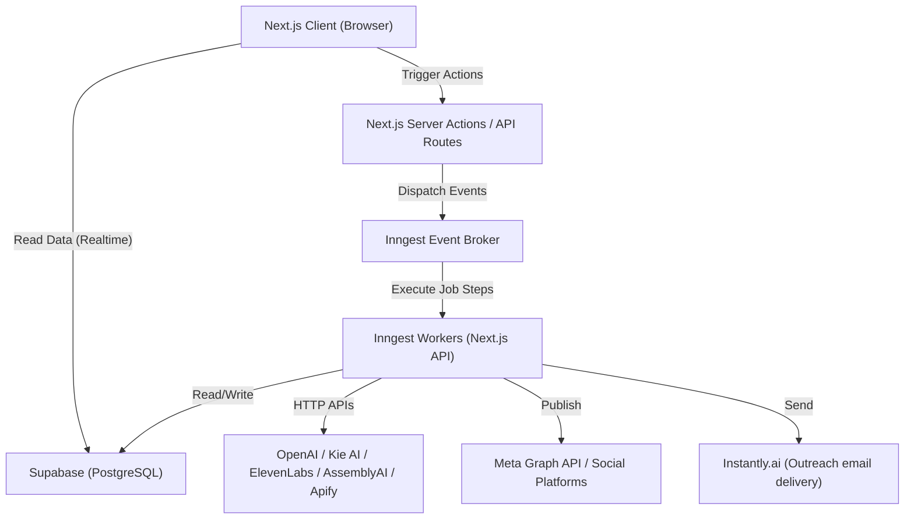

# System Design & Architecture

Kinetix follows a modern, serverless, event-driven architecture designed to handle long-running AI tasks without blocking the main web threads or running into serverless timeout limits.

**Tenancy:** the schema is multi-tenant-shaped (`businesses` + `business_users`), but Kinetix runs with exactly **one** `businesses` row today — there is one client. This is a deliberate choice: it costs nothing to operate single-tenant, and a second client later needs zero schema changes, just new rows. See §3.

## 1. High-Level Communication Flow



## 2. Component Responsibilities

### A. Next.js Frontend (App Router)
- **Responsibility:** UI rendering, routing, optimistic UI updates.
- **Data Fetching:** Direct database queries via `@supabase/ssr` (bypassing custom API routes), protected by Row Level Security (RLS). This enables fast reads and realtime subscription capabilities.

### B. Next.js Backend (Server Actions / API Routes)
- **Responsibility:** Secure operations only.
- **Usage:** Used *only* for things the client cannot do securely — chiefly, dispatching background events to Inngest (`inngest.send()`, e.g. `meta-ads/generate-image`, `outreach/scrape-contacts`) and calling third-party APIs with server-only secrets (Meta Graph, Instantly, Upload-Post) that a browser could never hold safely.
- **No inbound webhooks and no OAuth callbacks today.** Meta Ads' Leads previously used a real-time Lead Ads webhook; it was removed in favor of a scheduled background sync instead (see §2.D below and `modules/meta_ads.md`). Social Media never does OAuth itself — accounts are connected on Upload-Post's own dashboard (see `modules/social_media.md` §3). If either is ever added back, it belongs in this layer.

### C. Supabase (Database & Auth)
- **Auth:** Supabase Auth only. RLS's `auth.uid()` requires Supabase-issued JWTs — there is no separate NextAuth session layer in this app.
- **Database:** PostgreSQL. Every piece of client data belongs to a `business`, not directly to a `user` — see §3. Users join a business via the `business_users` junction table.
- **Security:** RLS policies ensure a user can only read/write rows where a `business_users` row links their `auth.uid()` to that row's `business_id`. With one business today, every user simply has one `business_users` row (auto-created — see §3) — functionally equivalent to a simpler model, but the isolation is real and already enforced, not bolted on later.
- **Vault:** Supabase Vault stores provider secrets (OpenAI, Apify, ElevenLabs, Kie, AssemblyAI) and OAuth tokens (Meta, TikTok, LinkedIn, YouTube, X) by reference — `secret_vault_ref` / `access_token_vault_ref` columns point at a Vault entry; the raw secret never sits in a Postgres column.

### D. Inngest (Background Job Engine)
- **Responsibility:** Managing long-running, error-prone tasks.
- **Why Inngest?** AI video generation (Kie AI) can take up to 3–5 minutes. Vercel serverless functions time out after 10–60 seconds. Inngest's step functions (`step.run`, `step.sleep`) pause execution, wait for the external job to finish, and resume — without holding a Vercel function open or hitting the timeout.
- **Canonical jobs.** The authoritative list is whatever's actually in the `functions` array exported from `src/services/inngest/functions.ts` — a function not in that array never registers, even if `createFunction(...)` exists elsewhere in the codebase. This table is that array, verified, not an idealized/proposed list:

| Job | Trigger | Event name / cron |
|---|---|---|
| Self-ad performance analysis | cron, hourly — see note below | `0 * * * *` |
| Meta Ads performance sync (writes `ad_performance_daily`) | cron, daily | `0 4 * * *` |
| Meta ad creative generation (image) | event | `meta-ads/generate-image` |
| Meta ad creative generation (video) | event | `meta-ads/generate-video` |
| Social post generation (image) | event | `social/generate-image` |
| Social post generation (video) | event | `social/generate-video` |
| Scheduled social post publish | event, one instance per scheduled post — not a recurring poll | `social/scheduled-post-created` |
| Social/Root dashboard analytics cache refresh | cron, every 5 min | `*/5 * * * *` |
| Meta Ads leads sync | cron, every 5 min | `*/5 * * * *` |
| Outreach lead scraping | event (triggered from Find Leads) | `outreach/scrape-contacts` |
| Outreach campaign send | event (triggered from the Campaigns list, not a cron) | `outreach/send-campaign` |

**Why the self-ad-analysis job runs hourly, not weekly:** each business picks its own day/hour for this report via Settings' "Analysis Schedule" (`businesses.self_ad_analysis_schedule_day/hour` — see `modules/settings.md`). Inngest's own cron trigger can't read a per-business DB value at schedule-definition time, so instead the job runs on a fixed hourly cron and, on every tick, calls `shouldRunScheduledJob()` (`src/services/scheduling/business-schedule.ts`) per business to decide whether *this* is the hour it's actually due to run. (The competitor-scrape job used to follow this same pattern via `competitor_analysis_schedule_day/hour` before it was removed — those columns may still exist on `businesses` but are no longer read by anything.)

Every event payload carries `business_id` explicitly. Inngest functions run with the Supabase service-role key, which bypasses RLS entirely — scoping for background writes comes from the payload, never inferred from a session (there is no user session inside a background worker).

The Outreach scrape job (`scrapeOutreachContacts`) reports its progress purely through `outreach_scrape_jobs.status` — earlier versions pushed realtime Supabase broadcasts to a global "jobs" widget on top of that, but a broadcast is a single unpersisted message with no replay: any WebSocket hiccup during the job's several-minute run silently and permanently lost the terminal "done" message, stranding the UI. That widget (and the whole global job-tracking store behind it) was removed — the Leads page now polls `outreach_scrape_jobs` directly (`useScrapeJobs`, see `modules/outreach.md`), the same page-scoped-polling pattern already used for Meta Ads/Social Media AI generation (`generationRefetchInterval` — see `modules/meta_ads.md` / `modules/social_media.md`). No global widget, no broadcast channel, one consistent pattern for every "something's generating/running in the background" case in the app.

### Never call a slow third-party API from a page-load GET route

Two real, measured regressions taught this lesson the hard way: the Meta Ads Leads page originally synced live from the Graph API on every page load (~7-8 seconds), and the Root/Social dashboards originally called Upload-Post's analytics endpoints live (~10 seconds — Upload-Post aggregates each connected platform's own API server-side). Both were fixed the same way, and it's now the standard pattern for anything backed by a slow external API:

- A scheduled Inngest job (every 5 minutes, for both cases above) is the **only** thing that ever calls the slow API, writing the result into our own table (`leads`; `upload_post_analytics_cache` — see `database_schema.md` §2).
- The page's own GET route **only ever reads that table** — a single fast Postgres query, independent of how slow the upstream API actually is.
- A manual "force refresh now" button (Leads' "Sync now") is fine to keep calling the live API synchronously — that's an explicit user action with its own loading state, not a passive page load nobody asked to wait on.

Meta Ads Leads previously used a real-time webhook instead of any of this (HMAC-verified, one-time Meta dashboard subscription); it was removed in favor of the scheduled-sync model above, since a webhook's added complexity (a stable public URL, secret management, a manual registration step) wasn't worth it for a single-tenant app where "fresh as of the last 5-minute tick" is good enough.

## 3. Tenancy Model

The schema is multi-tenant-shaped: every table hangs off `business_id`, and a `business_users` junction table links `auth.uid()` to the business(es) a user belongs to. Kinetix runs with **exactly one** `businesses` row today.

Running multi-tenant-shaped schema single-tenant costs nothing functionally — the one thing it requires is that every user actually gets enrolled in `business_users`, or RLS (§8 in `database_schema.md`) will correctly, but unhelpfully, show them nothing. That's closed with a trigger, mirroring the existing `on_auth_user_created` pattern that already auto-creates a `profiles` row:

```sql
CREATE OR REPLACE FUNCTION public.handle_new_user_business_membership()
RETURNS TRIGGER LANGUAGE plpgsql SECURITY DEFINER SET search_path = public AS $$
BEGIN
    INSERT INTO public.business_users (business_id, user_id, role)
    SELECT id, NEW.id, 'admin' FROM public.businesses LIMIT 1
    ON CONFLICT DO NOTHING;
    RETURN NEW;
END; $$;

CREATE TRIGGER on_profile_created_join_business
    AFTER INSERT ON public.profiles
    FOR EACH ROW EXECUTE FUNCTION public.handle_new_user_business_membership();
```

With this in place, onboarding a new team member needs no manual "add to business" step — they're enrolled automatically the moment their profile is created, same as today. Whenever a second `businesses` row is genuinely needed, this trigger's `LIMIT 1` is the one place that stops being correct — replace the auto-enroll with a real invite flow at that point. Nothing else in the schema changes.

One code-level follow-up for whenever the migration actually happens (not part of this doc pass): `src/services/auth/session.ts` and `permissions.ts` currently read `role` off `profiles.role` directly. With `business_users` as the membership table, role moves to the membership row (`business_users.role`) — a small but real code change, since a user's role is now scoped per-business-membership rather than global to their profile.

## 4. Intelligence: no RAG, no vector DB

Competitor and self-ad intelligence is generated by direct context-window prompting: the top-scored competitor ads, or a business's own "seasoned" ad metrics, are assembled into a single prompt and sent to OpenAI in one call. Kinetix does not use Pinecone or any vector store for this. The legacy n8n pipeline used a Pinecone-backed RAG step for competitor analysis; it's deliberately not carried forward — the data volumes involved (a few hundred competitor ads per business, not tens of thousands) don't need retrieval, and a single well-scoped prompt is simpler to build, debug, and reason about.

## 5. Root Dashboard — cross-module rollup

`/dashboard` (`src/modules/dashboard/`) is the app's landing page — `/` itself is a hard redirect to it (`src/app/page.tsx`), it isn't served at `/` directly. It's the only page that reads across all three product modules in one request, backed by a single `GET /api/dashboard?range=` handler that aggregates:

- **Meta Ads:** active campaign count, `ad_performance_daily` spend/impressions/clicks for the selected range, `leads` table count.
- **Outreach:** `OutreachCampaignsService.getCampaignsWithAnalytics()` (the same merge Outreach's own Dashboard and Campaigns page use), plus DB-only aggregates from `outreach_campaign_leads`/`outreach_leads`.
- **Social:** `platform_connections` status, plus Upload-Post profile analytics/impressions read from `upload_post_analytics_cache` — never a live Upload-Post call (see §2.D's "Never call a slow third-party API from a page-load GET route") — best-effort beyond that (a cache-read failure degrades gracefully rather than failing the whole dashboard).

Only two KPIs are genuine cross-module sums — **Total Leads** (Meta inbound + Outreach added) and **Total Reach** (Meta + Social impressions) — because those are the only concepts that are genuinely the same thing across modules. Everything else (spend, reply rate, followers) stays scoped to its own module; Outreach's "leads" (cold-scraped prospects) are never silently merged with Meta's "leads" (inbound Instant Form conversions) beyond that one explicitly-labeled combined KPI.

The page itself: a range switcher (7d/14d/30d/90d/All — `range=all` is a capped 180-day window, not a true earliest-row lookup), a KPI row, an acquisition funnel (Reach → Clicks → Leads), two trend charts (Leads by source, Reach by channel), three per-module trend cards linking out to that module's own Dashboard, and a channel comparison table. Current-state numbers (active campaigns, "sending now," followers) are live snapshots that don't rescope with the selected range — only the trend/summary numbers do.

## 6. Shared Pagination System

Every list page across all three modules (Meta Ads: Campaigns, Reports, Ad Library, Leads; Social: Posts; Outreach: Leads, Campaigns) uses one shared pagination contract instead of each inventing its own:

- **`src/lib/pagination.ts`** — the only two allowed page sizes, `PAGE_SIZE_COMPACT` (10, for tables and low-density grids) and `PAGE_SIZE_DENSE` (20, for denser card/thumbnail grids) — picked per page based on roughly how many items its layout shows per viewport, never a bespoke number. Plus three helpers: `paginationMeta(total, page, limit)` (returns `{ total, page, limit, totalPages }`, floored at 1 page), `rangeFor(page, limit)` (the `[from, to]` tuple for Supabase's `.range()`), and `paginateArray(items, page, limit)` (in-memory slicing for the one list that can't be paginated at the query level — see below).
- **`src/components/ui/Pagination.tsx`** — the one Prev/1…N…Last/Next control every paginated page renders, with page-number condensation (always page 1 and the last page, plus current±1, collapsing any gap into a single "…").
- **API contract:** every paginated route reads `page`/`limit` query params and returns its data array plus the spread of `paginationMeta(...)` alongside it (e.g. `{ campaigns, total, page, limit, totalPages }`) — the array key name stays domain-specific (`campaigns`, `leads`, `ads`, `lists`) rather than a generic `items`, for readability at each call site.
- **Client hooks** use TanStack Query's `keepPreviousData` so switching pages doesn't flash a loading skeleton — the previous page's rows stay visible until the next page resolves.

**The one exception — Social Posts is paginated in-memory, not at the query level.** A `social_posts` row exists per *platform a post targets*, not per logical post — one post published to 3 platforms is 3 rows, tied together only by a shared `media_asset_id` (or, for text posts with no media, a `created_at`+`idea_prompt` coincidence — see `modules/social_media.md` §8). Slicing raw rows with `.range()` could split one post's rows across two pages. So `Posts.tsx` fetches all rows (still a lightweight query), groups them client-side into `PostGroup[]` (existing logic, unchanged), then applies `paginateArray()` to the *grouped* list before rendering. This is the one page in the system that doesn't reduce its initial fetch size via pagination — a real, currently-accepted trade-off. Fixing it at the query level would need a schema change (a real `post_group_id` stamped at creation time for both image/video and text posts), which is a worthwhile follow-up but out of scope for the pagination pass that added this system.

Some hooks that back a *picker* rather than a *list page* deliberately stay unpaginated even though a paginated sibling exists for the same data — e.g. `useLeadLists()` (full list, for `FindLeadsModal`/`NewCampaignPage`'s dropdowns) alongside `usePaginatedLeadLists()` (for the Leads page's table). Both hit the same API route, which branches on whether `page`/`limit` are present in the query string at all.

## 7. Shared Dashboard UI Kit

`src/components/global/DashboardKit.tsx` is the one file the Root Dashboard and all three module dashboards (Meta Ads, Outreach, Social) are built from, so the four read as one product instead of four one-off designs. It exports:
- A fixed color system (`ACCENT` — purple/blue/green/amber/red, mapped to `DESIGN.md`'s tokens) and `CHART_SERIES`, a categorical color order that's never re-picked per chart (per the dataviz convention: color follows the entity, not its rank).
- `chartTickInterval(pointCount, targetLabels = 7)` — scales a chart's x-axis label interval to the actual number of data points, so labels never overlap regardless of how long a selected date range is (replacing an earlier fixed-threshold approach that broke down for very long ranges).
- Layout primitives: `Card`, `SectionTitle`, `KpiTile` (compact/tint/default variants), `EmptyState`.
- A matching family of loading skeletons — `KpiRowSkeleton`, `AreaChartSkeleton`, `PieChartSkeleton`, `BarRowsSkeleton`, `ProportionalListSkeleton`, `TableSkeleton`, `ModuleCardSkeleton`, and more — each built on the real `Skeleton` primitive (`src/components/ui/skeleton.tsx`) and shaped to mirror its corresponding real component's exact layout, so nothing visibly reflows once real data arrives. The same principle extends beyond dashboards: every list/detail page in the app (including the three Meta Ads detail pages, Ad Library, and Outreach's Campaign Detail) follows the same rule — real static chrome (headers, breadcrumbs, known labels) renders immediately, and only the genuinely data-dependent parts shimmer.
