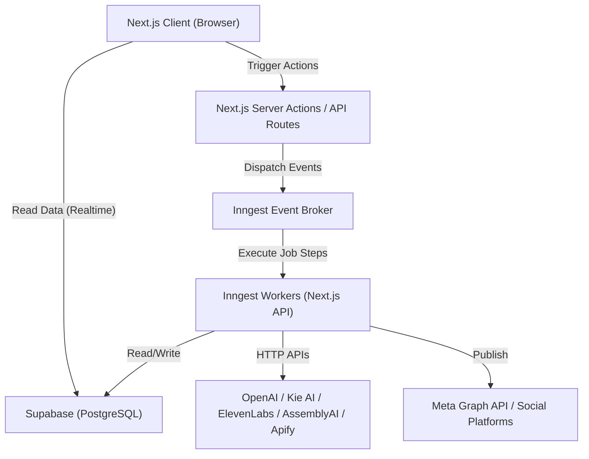

# System Design & Architecture

Kinetix follows a modern, serverless, event-driven architecture designed to handle long-running AI tasks without blocking the main web threads or running into serverless timeout limits.

**Tenancy:** the schema is multi-tenant-shaped (`businesses` + `business_users`), but Kinetix runs with exactly **one** `businesses` row today — there is one client. This is a deliberate choice: it costs nothing to operate single-tenant, and a second client later needs zero schema changes, just new rows. See §3.

## 1. High-Level Communication Flow



## 2. Component Responsibilities

### A. Next.js Frontend (App Router)
- **Responsibility:** UI rendering, routing, optimistic UI updates.
- **Data Fetching:** Direct database queries via `@supabase/ssr` (bypassing custom API routes), protected by Row Level Security (RLS). This enables fast reads and realtime subscription capabilities.

### B. Next.js Backend (Server Actions / API Routes)
- **Responsibility:** Secure operations only.
- **Usage:** Used *only* for things the client cannot do securely:
  1. Dispatching background events to Inngest (`inngest.send()`).
  2. Receiving webhooks from external platforms (Meta Lead webhooks, provider callbacks).
  3. OAuth callback handling.

### C. Supabase (Database & Auth)
- **Auth:** Supabase Auth only. RLS's `auth.uid()` requires Supabase-issued JWTs — there is no separate NextAuth session layer in this app.
- **Database:** PostgreSQL. Every piece of client data belongs to a `business`, not directly to a `user` — see §3. Users join a business via the `business_users` junction table.
- **Security:** RLS policies ensure a user can only read/write rows where a `business_users` row links their `auth.uid()` to that row's `business_id`. With one business today, every user simply has one `business_users` row (auto-created — see §3) — functionally equivalent to a simpler model, but the isolation is real and already enforced, not bolted on later.
- **Vault:** Supabase Vault stores provider secrets (OpenAI, Apify, ElevenLabs, Kie, AssemblyAI) and OAuth tokens (Meta, TikTok, LinkedIn, YouTube, X) by reference — `secret_vault_ref` / `access_token_vault_ref` columns point at a Vault entry; the raw secret never sits in a Postgres column.

### D. Inngest (Background Job Engine)
- **Responsibility:** Managing long-running, error-prone tasks.
- **Why Inngest?** AI video generation (Kie AI) can take up to 3–5 minutes. Vercel serverless functions time out after 10–60 seconds. Inngest's step functions (`step.run`, `step.sleep`) pause execution, wait for the external job to finish, and resume — without holding a Vercel function open or hitting the timeout.
- **Canonical jobs.** These are the *actual* event names in the working code — earlier drafts of this doc set invented idealized names (`generate-meta-creative`, `ads/competitors.scrape`) instead of checking what the real Inngest functions already used; this table has been corrected to match reality, not the other way around:

| Job | Trigger | Event name |
|---|---|---|
| Weekly competitor scrape (fan-out) | cron `0 0 * * 0` | — |
| Competitor scrape + analyze worker (per business) | event | `jobs/competitor-ad-scraper` |
| Weekly self-ad performance analysis | cron `0 2 * * 0` | — |
| Meta ad creative generation (image) | event | `meta-ads/generate-image` |
| Meta ad creative generation (video) | event | `meta-ads/generate-video` |
| Social post generation *(not yet built — proposed name)* | event | `social/post.generate` |
| Meta lead webhook *(not yet built — proposed name)* | event | `meta-ads/lead.received` |

Note there's no separate "weekly competitor analysis" row anymore — the scraper worker does both the scrape and the analysis in one job (see `ai_pipelines/intelligence_engine.md`), since nothing is persisted in between for a separate job to read.

  Every event payload carries `business_id` explicitly. Inngest functions run with the Supabase service-role key, which bypasses RLS entirely — scoping for background writes comes from the payload, never inferred from a session (there is no user session inside a background worker).

## 3. Tenancy Model

The schema is multi-tenant-shaped: every table hangs off `business_id`, and a `business_users` junction table links `auth.uid()` to the business(es) a user belongs to. Kinetix runs with **exactly one** `businesses` row today.

Running multi-tenant-shaped schema single-tenant costs nothing functionally — the one thing it requires is that every user actually gets enrolled in `business_users`, or RLS (§8 in `database_schema.md`) will correctly, but unhelpfully, show them nothing. That's closed with a trigger, mirroring the existing `on_auth_user_created` pattern that already auto-creates a `profiles` row:

```sql
CREATE OR REPLACE FUNCTION public.handle_new_user_business_membership()
RETURNS TRIGGER LANGUAGE plpgsql SECURITY DEFINER SET search_path = public AS $$
BEGIN
    INSERT INTO public.business_users (business_id, user_id, role)
    SELECT id, NEW.id, 'admin' FROM public.businesses LIMIT 1
    ON CONFLICT DO NOTHING;
    RETURN NEW;
END; $$;

CREATE TRIGGER on_profile_created_join_business
    AFTER INSERT ON public.profiles
    FOR EACH ROW EXECUTE FUNCTION public.handle_new_user_business_membership();
```

With this in place, onboarding a new team member needs no manual "add to business" step — they're enrolled automatically the moment their profile is created, same as today. Whenever a second `businesses` row is genuinely needed, this trigger's `LIMIT 1` is the one place that stops being correct — replace the auto-enroll with a real invite flow at that point. Nothing else in the schema changes.

One code-level follow-up for whenever the migration actually happens (not part of this doc pass): `src/services/auth/session.ts` and `permissions.ts` currently read `role` off `profiles.role` directly. With `business_users` as the membership table, role moves to the membership row (`business_users.role`) — a small but real code change, since a user's role is now scoped per-business-membership rather than global to their profile.

## 4. Intelligence: no RAG, no vector DB

Competitor and self-ad intelligence is generated by direct context-window prompting: the top-scored competitor ads, or a business's own "seasoned" ad metrics, are assembled into a single prompt and sent to OpenAI in one call. Kinetix does not use Pinecone or any vector store for this. The legacy n8n pipeline used a Pinecone-backed RAG step for competitor analysis; it's deliberately not carried forward — the data volumes involved (a few hundred competitor ads per business, not tens of thousands) don't need retrieval, and a single well-scoped prompt is simpler to build, debug, and reason about.
