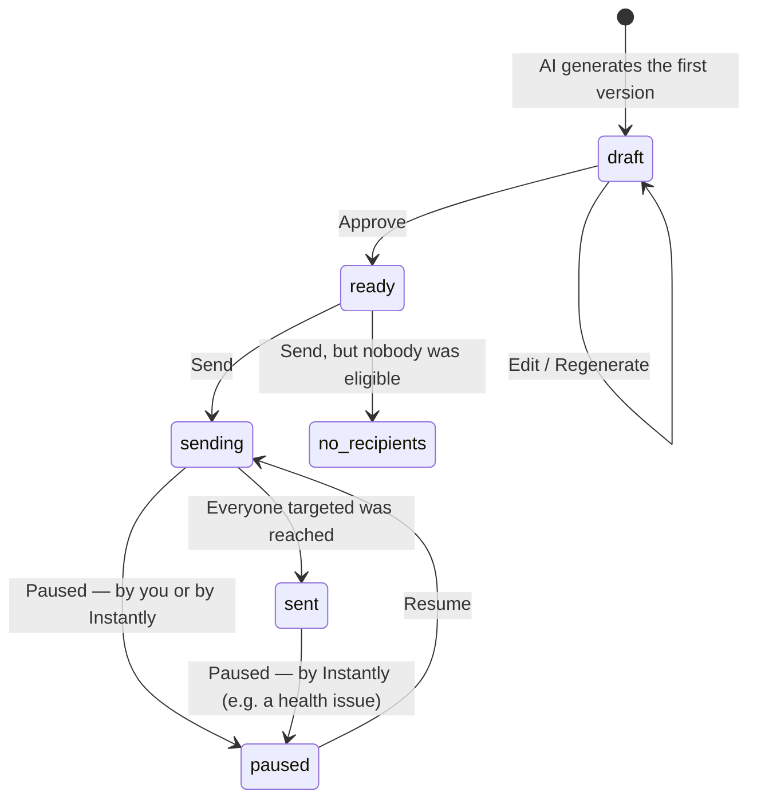
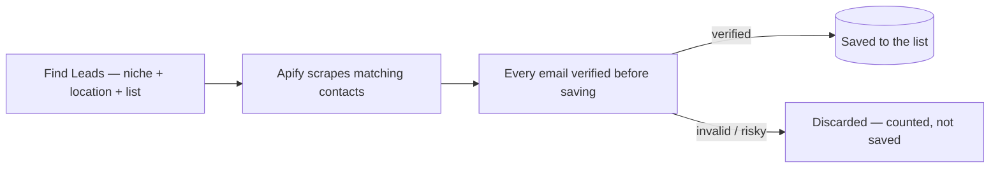
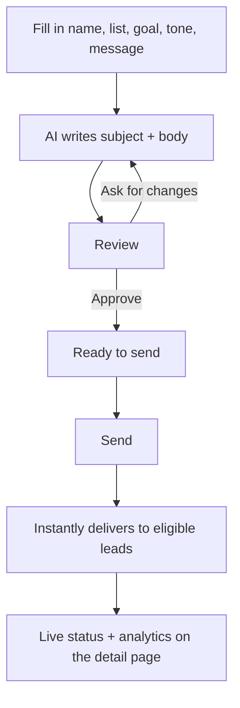

# Outreach & Lead Gen Module

**Status: built and active.**

## 1. What It Is

Outreach is Kinetix's cold-email lead-generation tool. It finds potential clients, organizes them into lists, writes personalized cold email campaigns with AI, and sends them through Instantly.ai — pulling live delivery results back into the app so every campaign shows real, current performance instead of a stale snapshot.

The whole module is built around one idea: **a human approves content once, and after that the system never re-derives it.** Whatever email is on a campaign at the moment it's approved is exactly what gets sent — not regenerated, not re-fetched — so there's never a surprise between what was reviewed and what a lead actually received.

## 2. Features

| Feature | What it does |
|---|---|
| **Lead Lists** | Named groups leads and campaigns organize around. Deleting a list orphans its leads rather than deleting them, so nothing is lost by accident. |
| **Lead Scraping** | Finds real business contacts by niche + location, verifies every email address before saving, and reports how many were found vs. rejected. |
| **Manual Lead Entry** | Add a single lead by hand when you already know who you want to reach. |
| **AI Campaign Drafting** | Generates a subject + body from a short brief (goal, tone, service, region) — ready to review, not just a rough draft. |
| **Feedback-Driven Regeneration** | Ask the AI to revise the draft in plain English; every prior version is kept so nothing is lost if a revision goes the wrong way. |
| **Manual Editing** | Rewrite the subject/body by hand at any time before sending — no AI round-trip required. |
| **Sending via Instantly.ai** | One dedicated Instantly campaign per Kinetix campaign, sent to whichever leads are actually eligible right now. |
| **Unified Campaign Status** | One clear status per campaign (see §4), instead of juggling a local workflow state and Instantly's own delivery state separately. |
| **Live Analytics** | Sent / opened / replied / clicked / bounced, always fetched fresh from Instantly — never cached. |
| **Pause & Resume** | Stop a sending campaign at any time and pick it back up later without losing its progress. |
| **Send Preview** | Before confirming a send, see exactly which list it's going to and how many leads are actually eligible right now. |

## 3. Pages

| Page | Route | What you can do there |
|---|---|---|
| Dashboard | `/outreach` | A KPI row (total leads, sending now, emails sent, open/reply/bounce rate) plus a sends-trend chart, a lead-status breakdown, and a per-campaign performance chart — always live, never a stored snapshot. |
| Leads | `/outreach/leads` | Manage lists (paginated table), scrape or manually add leads, browse a list's leads in a side drawer. |
| Campaigns | `/outreach/campaigns` | See every campaign's status at a glance (paginated table); send, pause, resume, or delete from the same table. |
| New Campaign | `/outreach/campaigns/new` | Fill in a short brief and generate the first AI draft — creation only, nothing else lives here. |
| Campaign Detail | `/outreach/campaigns/:id` | Review/edit the email, see campaign settings and (once sending) live performance, side by side. |

### 3.1 Leads page, in a bit more detail

The Leads page shows **lists**, not individual leads — each list is a row with its own live lead count, in a paginated table (see §7.1). Opening a list slides in a drawer showing every lead in it (loaded a page at a time as you scroll, rather than all at once). From there you can add a lead by hand, or close the drawer and use "Find Leads" to scrape a whole new batch into any list.

Two hooks back the same underlying `GET /api/outreach/lists` route: `useLeadLists()` (unpaginated — used by pickers like "Find Leads" and New Campaign's list dropdown, which need every list at once) and `usePaginatedLeadLists(page, limit)` (used by this page's own table). The route itself branches on whether `page`/`limit` are present in the query string, so both call shapes hit the exact same endpoint.

### 3.2 Campaigns page, in a bit more detail

Every action a campaign might need lives in this one table, so there's never a hunt across multiple screens for "how do I pause this" — the row itself tells you what state a campaign is in, and offers exactly the one or two actions that make sense for that state (Send only appears once something's actually ready; Pause and Resume never both show up on the same row). Sending is confirmed with a live preview first — which list, how many leads are eligible right now, and how many will actually go out this run once the daily limit is applied — so a "Send" click is never a surprise about who's about to receive something.

### 3.3 Campaign Detail, in a bit more detail

This page is deliberately split into two halves that answer two different questions:
- **The left side** answers *"what is this campaign and how is it doing"* — its name, status, the settings it was created with, and (once it's actually sending) its live performance numbers.
- **The right side** answers *"what does the email actually say, and what can I do about it right now"* — the email itself, plus whichever action makes sense for its current status: edit/regenerate while it's a draft, a note pointing you to the Send button once it's approved, nothing extra once it's out the door.

## 4. Campaign Status, at a Glance

Every campaign is always in exactly one of six states — the UI never shows Kinetix's internal workflow field or Instantly's raw delivery code directly, only this:

`paused` always comes with a reason (e.g. *"Paused by you"* vs. *"Instantly flagged a sending-account issue"*) so it's never ambiguous who or what stopped it.

| Status | What it means | Shown when |
|---|---|---|
| **Draft** | Content generated, not yet reviewed | Always, until approved |
| **Ready to Send** | Approved, hasn't been sent yet | After Approve, before the first Send |
| **No Recipients** | A send was attempted, nobody qualified | Every eligible lead was suppressed, contacted, or the list was empty |
| **Sending** | Actively going out | After Send, before every recipient is reached |
| **Sent** | Fully delivered to everyone targeted | Every recipient reached, or Instantly reports the sequence complete |
| **Paused** | Stopped | By you, or automatically by Instantly |

## 5. How It Works

### 5.1 Finding leads

The Leads page shows a running banner for as long as the scrape is active — it polls `outreach_scrape_jobs` directly (`useScrapeJobs`, every 4 seconds while something's queued/running) and clears on its own once the job finishes, no manual refresh needed. This is the same page-scoped-polling pattern Meta Ads/Social Media use for AI generation, not a global "jobs" widget — an earlier version pushed realtime broadcasts to one instead, but a broadcast is a single unpersisted message that a several-minute job's terminal "done" event could silently miss if the browser's WebSocket had any hiccup, permanently stranding the banner. Only addresses that come back genuinely **verified** are ever saved — anything invalid, risky, or unknown is discarded and simply counted, never stored as a half-good lead.

### 5.2 Drafting and sending a campaign

A lead is "eligible" for a send if they haven't bounced, opted out, or already replied — but being emailed by *one* campaign never blocks a *different* campaign from reaching them later, since interest can genuinely differ by offer. Each campaign gets its own dedicated Instantly campaign, so campaigns never interfere with each other's sequences, and pausing or resuming one never touches another.

### 5.3 A lead's own journey

Separately from any one campaign, every lead carries its own status as replies come in: `new` → `contacted` (once any campaign reaches them) → `replied` / `interested` / `not_interested`, or `bounced` / `do_not_contact` if they should never be emailed again. This status is what future campaigns check before including someone — not whether *this specific* campaign has reached them before.

## 6. Data Model

Full column-level detail lives in [`../architecture/database_schema.md`](../architecture/database_schema.md) §8 — summary:

| Table | Holds |
|---|---|
| `outreach_lead_lists` | Named lists. |
| `outreach_leads` | The people themselves — contact info, source, verification status, and their own outreach status (new, contacted, replied, bounced, …). |
| `outreach_campaigns` | The campaign itself — brief, generated content, revision history, and its linked Instantly campaign. |
| `outreach_campaign_leads` | Per-campaign send record — separate from a lead's own status, so the same lead can be targeted again by a different campaign. |
| `outreach_scrape_jobs` | One row per "Find Leads" run and its results. |
| `businesses.outreach_settings` | Daily send limit, timezone, sending days, and send window — editable via Settings → Automation Defaults → Outreach Defaults (see `settings.md`). |

## 7. API Surface (`/api/outreach/**`)

| Route | What it does |
|---|---|
| `analytics` | Cross-references every campaign against live Instantly delivery data and resolves its unified status. |
| `campaigns` | List every campaign (paginated), or create a new one (which also triggers AI drafting immediately). |
| `campaigns/[id]` | Fetch one campaign, or update it — manual edit, AI regeneration, approve, pause, or resume, all through the same endpoint. |
| `campaigns/[id]/send` | Fires off an actual send. |
| `campaigns/[id]/send-preview` | Reports who a send would actually reach, before you confirm it. |
| `dashboard` | Builds the whole Dashboard payload — KPIs, sends trend, lead-status breakdown, and campaign performance, in one call. |
| `leads` | List/search leads (paginated), or add one manually. |
| `leads/[id]` | Delete a single lead. *(No update/PATCH handler exists for an individual lead today — editing isn't supported past creation.)* |
| `leads/[id]/history` | Every campaign a given lead has ever been part of. |
| `lists` | List every lead list — paginated if `page`/`limit` are passed, the full list otherwise (see §3.1) — or create a new one. |
| `lists/[id]` | Rename or delete a list. |
| `scrape` | Starts a new lead-scraping run. |
| `scrape/jobs` | Check on scrape runs in progress or already finished. |

### 7.1 Pagination

Leads (Lead Lists table) and Campaigns both paginate server-side at `PAGE_SIZE_COMPACT` (10) through the shared system described in `../architecture/system_design.md` §6. Paginating Campaigns has a real side benefit beyond the UI: `getCampaignsWithAnalytics` runs one Supabase count query per *currently-active* campaign to distinguish "sending" from "sent" — fewer campaigns fetched per page means fewer of those queries per request, on top of the smaller response payload.

## 8. Instantly.ai — Things Worth Knowing

- Every Kinetix campaign gets its **own** Instantly campaign — never shared or reused across campaigns.
- A new Instantly campaign starts in **Draft** and must be explicitly activated; it never sends on its own.
- "Resume" and the very first "Send" use the exact same activation call — there's no separate resume endpoint.
- Instantly's analytics endpoint returns the *entire* workspace, not just this app's campaigns — Kinetix filters it down itself.
- There's no in-app control over *which* connected mailbox sends a campaign — it always uses whichever accounts are currently healthy.
- Pausing requires an explicit (if empty) request body — Instantly rejects a truly bodyless pause/activate call.

## 9. Analytics, in a Bit More Detail

The Dashboard's totals and every campaign's Sent/Opened/Replied/Clicked/Bounced numbers all come from the same single call to Instantly, made fresh on every page load — there's no cached or nightly-synced version of this data anywhere. A couple of things shape how those numbers add up:
- **Rates are computed, not stored** — Opened/Replied/Clicked/Bounced are each shown as a percentage of that campaign's own Sent count, so a campaign with very few sends can show a rate that jumps around a lot until it has more volume.
- **The Dashboard's totals only count campaigns that are currently `sending` or `sent`** — a paused or draft campaign's numbers (if it has any) don't get folded into the headline totals, so the Dashboard always reflects "what's actually moving," not everything that's ever existed.
- **Unsubscribes are tracked but not shown** — the data comes back from Instantly and is available, it just isn't surfaced on a screen yet.

## 10. Why It's Built This Way

- **One AI-written template per campaign, not one per lead.** Personalization comes from Instantly substituting each recipient's name/company into the same approved template at send time — not from generating a unique email per person. This keeps what gets reviewed and approved identical to what gets sent, with no per-recipient variation to double-check.
- **The campaign row exists before the AI call, not after.** If AI generation fails, there's still a visible, retriable draft — never a lost submission with nothing to show for it.
- **Sending only happens from the Campaigns list, never the detail page.** Keeping every "send" entry point in one place, with one confirmation flow showing exactly who it'll reach, avoids the content and the send action drifting out of sync.

## 11. Known Limitations

- No update/edit endpoint for an individual lead once created (`leads/[id]` only supports delete) — a lead's contact details can't be corrected after entry, only removed and re-added.
- Analytics are campaign-level only — no per-lead open/click tracking.
- No reply-sentiment detection or auto-pause on a positive reply.
- No multi-step drip sequencing — one email per campaign, not a sequence with waits between steps.
- No confirmation prompt before approving a campaign, or before deleting a list or a single lead — unlike send/pause/resume/delete-campaign, which all confirm first.
- The "how many will this actually send to" preview doesn't account for a campaign that's already partially sent — retrying a send can slightly overstate how many *new* people will be reached.

Key implementation files (for developers going deeper)

| Concept | File |
|---|---|
| Pages | `src/modules/outreach/pages/*.tsx` |
| Unified status logic | `src/modules/outreach/utils/campaign-status.ts` |
| Instantly API wrapper | `src/services/instantly/client.ts` |
| Send job | `src/services/inngest/outreach/send-campaign.ts` |
| Scrape job | `src/services/inngest/outreach/scrape-contacts.ts` |
| Campaign AI prompts | `src/prompts/outreach/index.ts` |
| API routes | `src/app/api/outreach/**` |

