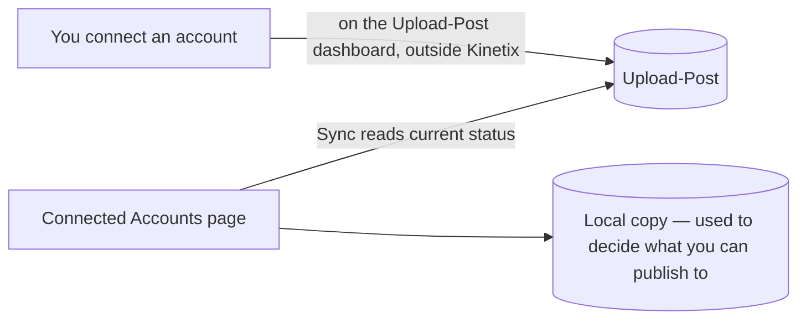
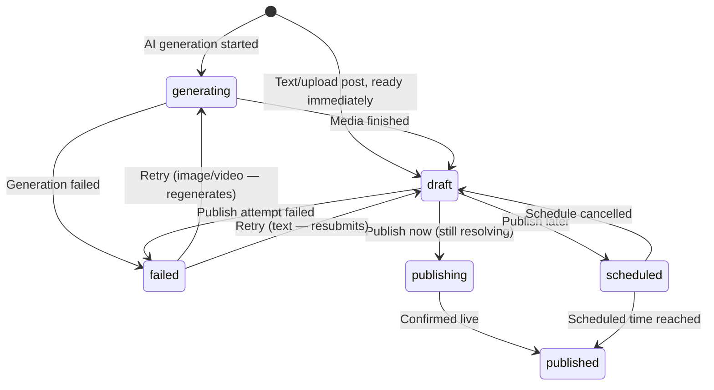
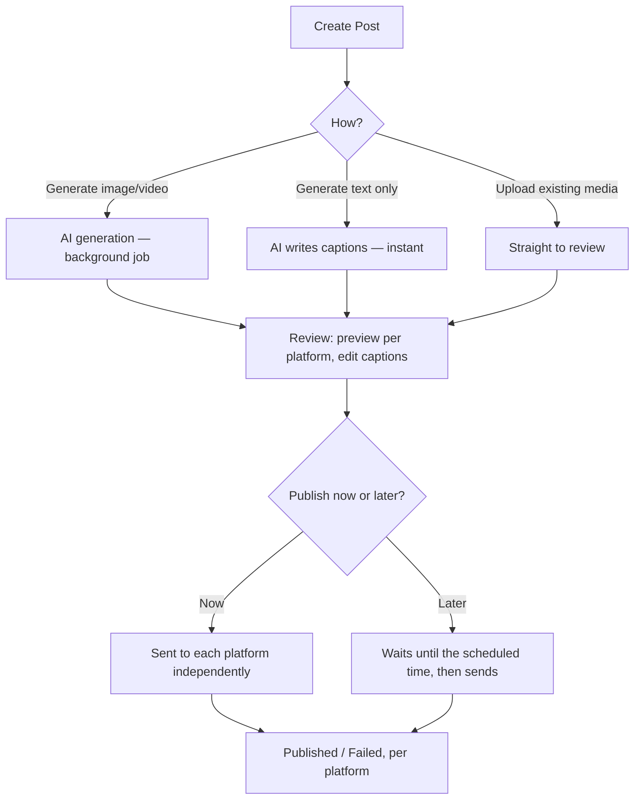

# Social Media Module

**Status: built and active.**

> **Correction:** earlier versions of this doc described publishing as real per-platform OAuth + direct API calls. That was true for one commit and was replaced the very next commit with a third-party publishing service (Upload-Post) — the doc was never updated to match. This version describes what's actually running today. See §3 for what changed and why it matters.

## 1. What It Is

Social Media generates image or video posts with AI, shows exactly how each one will look on every target platform before anything goes live, and publishes them — now or on a schedule — across Facebook, Instagram, LinkedIn, X, TikTok, and YouTube.

Like Outreach, it's built around one idea: **what you approve is what goes out.** A post is generated once, previewed exactly as it'll appear on each platform, and only then published — with every platform tracked as its own independent outcome, so one platform failing never drags the others down with it.

## 2. Features

| Feature | What it does |
|---|---|
| **AI Content Generation** | One idea in, one image or video out — plus a tailored caption per platform, in one step. |
| **Idea Expansion** | Turns a rough one-line idea into three ready-to-use angles before you commit to generating anything. |
| **Text-Only Posts** | Skip media entirely and publish a caption-only post where the platform supports it. |
| **Upload Existing Media** | Skip generation entirely and publish something you already have. |
| **Per-Platform Preview** | See a realistic mock of the post as it'll actually look on each platform — same layout, avatar, and caption — before publishing. |
| **Caption Editing & AI Improve** | Edit any caption by hand, or ask AI to improve it, right up until you publish. |
| **Scheduling** | Publish now, or queue a post for a specific future time. |
| **Independent Per-Platform Status** | Posting the same content to 3 platforms is 3 independent outcomes — one platform failing never blocks or rolls back the others. |
| **Retry** | Failed posts can be retried — regenerated from scratch for image/video, or simply resubmitted for text. |
| **Cancel a Schedule** | Pull back a scheduled post any time before it fires, reverting it to a draft. |
| **Media Library** | Every piece of generated or uploaded media is kept in a shared library, independent of any single post. |

## 3. Connecting Accounts — How It Actually Works

Kinetix does **not** perform OAuth for social accounts. Connecting an account happens on a separate service's own dashboard (Upload-Post); Kinetix simply mirrors that connection status so the app knows what it's allowed to publish to.

A few things worth knowing about this:
- **The "Connected Accounts" page in Kinetix is a mirror, not a control panel** — to actually connect or disconnect something, you go to Upload-Post's own dashboard (a link on that page takes you there directly). Kinetix's "Sync" button just refreshes what it already knows.
- For Facebook and LinkedIn specifically, the sync step also resolves which **Page** you actually publish as — the underlying account can be logged in as a person but posting as a business Page, and Kinetix needs to know which Page that is before it can publish there.
- If a sync shows an account as disconnected, that's Upload-Post reporting it as revoked (e.g. an expired login) — reconnecting happens on their side, not by clicking anything in Kinetix.

## 4. Post Status, at a Glance

Every platform a post targets tracks this independently — publishing the same content to three platforms produces three rows, each moving through this diagram on its own. One platform ending up `failed` never changes the others.

## 5. Platforms Supported

| Platform | Image | Video | Text-only |
|---|:---:|:---:|:---:|
| Facebook | ✅ | ✅ | ✅ |
| Instagram | ✅ | ✅ | ❌ |
| LinkedIn | ✅ | ✅ | ✅ |
| X (Twitter) | ✅ | ✅ | ✅ |
| TikTok | ❌ | ✅ | ❌ |
| YouTube | ❌ | ✅ | ❌ |

These capabilities gate what you can even attempt — e.g. a text-only post only offers Facebook, X, and LinkedIn as targets, since the others have nowhere to put caption-only content.

## 6. Pages

| Page | Route | What you can do there |
|---|---|---|
| Posts | `/social/posts` | Browse everything generated or uploaded so far, grouped by status, and start a new post. |
| Publish | `/social/posts/publish` | The review wizard for a post already created — pick platforms, preview, then schedule or publish. |
| Connected Accounts | `/social/connected-accounts` | See which accounts are connected right now and jump to Upload-Post to manage them. |

## 7. How Publishing Works

Generation itself (writing the script, generating the image/video, adding voiceover) is entirely Kinetix's own AI pipeline — the same one built for Meta Ads. Only the final "publish this to Facebook/Instagram/etc." step is handed off to Upload-Post, which is what makes independent per-platform status possible: each platform is its own request, so one failing never affects the others.

### 7.1 Scheduling, in a bit more detail

A scheduled post is checked exactly once, right around its scheduled time — not on a recurring timer — so scheduling a post a month out doesn't cost anything until it's actually due. The same one-time check also covers a "publish now" post that Upload-Post itself couldn't resolve instantly (larger videos in particular sometimes finish processing a little after the request returns) — it's the same waiting mechanism either way, just with a different wait time.

### 7.2 Review, in a bit more detail

The review step is where you see the post as it'll really look — not a generic form, but a mock of each platform's actual feed (its own layout, avatar, and action icons), one tab per selected platform. Captions can be adjusted per platform independently, since the same idea often needs a different tone or length depending on where it's going, and an "Improve with AI" pass is available on any caption without leaving this screen.

## 8. Data Model

Full column-level detail lives in [`../architecture/database_schema.md`](../architecture/database_schema.md) §7 — summary:

| Table | Holds |
|---|---|
| `social_posts` | One row per platform per post — its status, caption/title, generation inputs, and links to its media and connection. |
| `media_assets` | The shared library of every generated or uploaded image/video, independent of any one post. |
| `platform_connections` | A local mirror of which accounts are connected on Upload-Post (`account_kind = "upload_post"`), plus the Facebook/LinkedIn Page IDs needed to publish. |

Posting the same generated video to Instagram and TikTok is genuinely **two rows** in `social_posts`, sharing the same underlying media but tracked, captioned, and published completely independently.

## 9. API Surface (`/api/social/**`)

| Route | What it does |
|---|---|
| `posts/generate` | Starts AI image/video generation for one or more platforms. |
| `posts/generate-text` | Writes a caption-only post immediately, no background job. |
| `posts/generate-idea` | Expands a rough idea into a few angle variations — doesn't save anything. |
| `posts/improve-caption` | Rewrites a single caption with AI feedback. |
| `posts/upload` | Publishes existing media directly, skipping generation. |
| `posts/prepare-platforms` | Builds/refreshes the per-platform preview data for the Publish wizard. |
| `posts/publish` | The actual hand-off to Upload-Post — now or scheduled. |
| `posts/cancel-schedule` | Pulls back a scheduled post, reverting it to a draft. |
| `posts/retry` | Retries a failed post — regenerates media, or just resubmits for text. |
| `upload-post/sync` | Refreshes the local connection mirror from Upload-Post. |

## 10. Notable UI Touches

- **The per-platform previews are realistic mockups, not a live embed** — each one recreates that platform's real feed layout (avatar, name, caption placement, action icons) so what you see is a faithful stand-in for the real thing, but the engagement numbers shown alongside it are just placeholder styling, not actual data pulled from anywhere.
- **The Posts grid uses a true masonry layout**, not a simple multi-column list — media of very different shapes (a tall video next to a wide image) sit next to each other without leaving awkward gaps, the way a naive column layout would.
- **Connected Accounts and the Publish flow's platform picker share one component** — the same platform "tile" just switches between showing status only and being clickable/selectable, so the two screens always look and behave consistently rather than drifting into two different pickers over time.

## 11. Why It's Built This Way

- **Publishing is delegated, generation isn't.** Writing and rendering the content is Kinetix's own pipeline because that's the part with real product value and AI cost worth owning; getting bytes onto six different platforms' APIs reliably is a solved, maintained problem elsewhere, so it's bought rather than rebuilt.
- **One row per platform, not one row per post.** This is what makes "Instagram published, TikTok failed" representable at all — a single post row could only ever hold one outcome.
- **One-shot scheduled checks instead of a recurring cron.** A cron that scans "what's due" every few minutes would do most of its work checking posts that aren't due yet. A single job per post that wakes up once, right when it's needed, costs nothing while waiting.

## 12. Known Limitations

- A background "song" can be attached to a video post, but it isn't mixed into the final audio yet.
- Carousel (multi-image) posts aren't available yet, even though some groundwork for them exists in the data model.
- A scheduled/publishing post that takes unusually long to resolve on the publishing side has no automatic follow-up after the first check window — it would need a manual look.
- No way to edit a post that's already scheduled — only cancel it and start over.
- Retrying an image/video post always regenerates the media from scratch, even if only the publish step actually failed.

Key implementation files (for developers going deeper)

| Concept | File |
|---|---|
| Pages | `src/modules/social/pages/*.tsx` |
| Publishing service (Upload-Post) | `src/services/upload-post/*.ts` |
| Generation jobs | `src/services/inngest/social/*.ts` |
| Scheduling reconciliation job | `src/jobs/social-scheduled-post-check.job.ts` |
| Per-platform preview components | `src/modules/social/components/previews/*.tsx` |
| API routes | `src/app/api/social/**` |
| Connection status table | `platform_connections` (`account_kind = "upload_post"`) — see [`../architecture/database_schema.md`](../architecture/database_schema.md) §2 |

